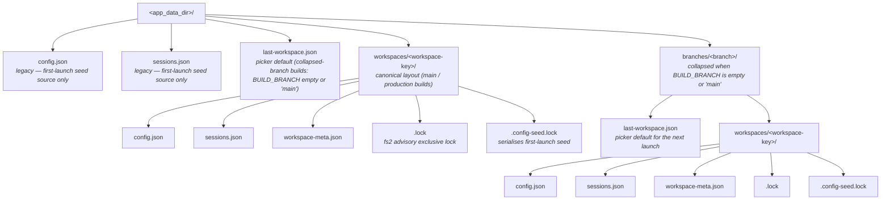

# Arborist configuration

Arborist keeps all persistent state in JSON files inside the OS-specific
**app data directory** that Tauri provides. Most workspace-level knobs
(workspace root, instruction-sets directory, pre-launch commands, per-agent
CLI launch overrides) are editable in the in-app **Settings** dialog
(reachable from the sidebar footer), and the active workspace can be
swapped at runtime from the same dialog without restarting. This document
is the reference for the on-disk layout, the minimum valid `config.json`,
hand-editing knobs that don't yet have a UI (per-worktree pre-launch
overrides), and what to do when Arborist quarantines a corrupt file. If
you do hand-edit, shut down the **specific Arborist instance** bound to
that `(branch, workspace)` pair first and reload by relaunching it.

## On-disk layout

| OS      | Path                                                       |
| ------- | ---------------------------------------------------------- |
| Windows | `%APPDATA%\com.arborist.app\` (typically `C:\Users\<you>\AppData\Roaming\com.arborist.app\`) |
| macOS   | `~/Library/Application Support/com.arborist.app/`             |
| Linux   | `$XDG_DATA_HOME/com.arborist.app/` or `~/.local/share/com.arborist.app/` |

> The leaf directory name is taken from the Tauri `identifier` field in
> `src-tauri/tauri.conf.json`. If that value changes the directory changes
> with it.

Inside that directory, every running Arborist process binds to **one
(branch, workspace) pair** and writes its `config.json`/`sessions.json` under
a per-pair subdirectory:



The **branch axis** is keyed off the build-time `BUILD_BRANCH` (see
`build.rs`); for a `main` (or untagged) build the `branches/<…>/` segment
collapses, mirroring the title-bar's `window_title_for_branch` rule. The
**workspace axis** is keyed off a deterministic hash of the canonicalised
workspace root path. Two parallel Arborist instances bound to different
pairs therefore touch disjoint files, and the `.lock` file inside each
pair's directory guarantees only one process can bind that pair at a time.

The legacy `config.json` / `sessions.json` directly under `<app_data_dir>`
are still read as a one-time fallback when no per-pair file exists yet
(seed-on-first-launch); after the first save the per-pair files are
authoritative and the legacy files are ignored.

| File                  | Purpose                                                                                |
| --------------------- | -------------------------------------------------------------------------------------- |
| `config.json`         | The user-editable [`AppConfig`](../../src-tauri/src/types.rs).                          |
| `sessions.json`       | Backend-only mirror of every persisted [`Session`](../../src-tauri/src/types.rs).       |
| `workspace-meta.json` | The canonical workspace root path that this directory was seeded for (used by tooling and tests). |
| `.lock`               | `fs2` advisory exclusive lock held for the process lifetime. Empty file. |
| `.config-seed.lock`   | Short-lived lock held only during first-launch seeding. Empty file. |
| `last-workspace.json` | Hint file under `branches/<branch>/` (or top level for `main` builds) recording the most-recently-bound workspace; consulted at boot before the picker. |

You almost never need to touch `sessions.json` by hand — Arborist rewrites it on
every session create/close/restart. If you do, shut down the Arborist instance
that is bound to that (branch, workspace) pair first; sibling instances bound
to other pairs can keep running.

## Minimum valid `config.json`

```json
{
  "configVersion": 5,
  "defaultInstructionSets": {
    "claude": "claude-default",
    "copilot": "copilot-default"
  },
  "instructionSetsDir": "/absolute/path/to/instructions",
  "workspaceRoot": "/absolute/path/to/repo",
  "worktreeRoots": ["/absolute/path/to/repo"],
  "worktreePrepCommands": [],
  "aiLaunchCommands": { "claude": "", "copilot": "" },
  "lastOpenSessions": [],
  "tabOrder": []
}
```

Field notes:

- `configVersion` — schema version of the file. Currently `5` (see
  `CONFIG_VERSION_CURRENT` in `src-tauri/src/types.rs`). Bumped only when
  the on-disk shape changes; older versions are quarantined (see below).
- `instructionSetsDir` — must be an **absolute** path that points at an
  existing directory. The path is canonicalized on load (symlinks resolved,
  `..` collapsed). Relative values are rejected when written via the
  `config_set` command and silently cleared when read from `config.json`.
- `workspaceRoot` — single, optional anchor repository. Must be an
  **absolute** path to a Git repository (validated via `git rev-parse`). When
  set, this is the repo Arborist treats as the primary workspace: the
  `.worktrees/` convention (see `WORKTREES.md`), the workspace indicator,
  and new-worktree creation all derive from it. Cleared (set to `null`) on
  load if the path no longer exists, which re-triggers the first-boot
  picker.
- `worktreeRoots[]` — legacy companion to `workspaceRoot`; same path rules
  as `instructionSetsDir`. Entries that no longer exist on disk are dropped
  (with a warning) on load. Retained for forward compatibility; new
  installations should use `workspaceRoot`.
- `worktreePrepCommands[]` — one-shot setup commands that run **once**, in
  the new worktree's directory, when a worktree is created via
  `worktree_create` (issue #63). Combined stdout+stderr is captured to
  `<app_data_dir>/worktree-prep-logs/<prepId>.log`; lifecycle is reported
  through the `worktree://prep` event. Blank/whitespace-only entries are
  filtered out. They run as the user — review them carefully. Renamed from
  `prelaunchCommands` in `configVersion = 5`. The previous per-CLI-launch
  semantics were removed; if you need to re-run setup on every session,
  bake it into a script invoked via `aiLaunchCommands` instead.
- `defaultInstructionSets.{claude,copilot}` — IDs of the default instruction
  set per tool. The ID is the filename (without the `.md` extension) of the
  file inside `instructionSetsDir`. If the configured ID isn't present, the
  loader falls back to the discovered default for that tool (see below).
- `aiLaunchCommands.{claude,copilot}` — per-tool CLI launcher override.
  Empty string (the default) means "use the bare tool name" (`claude` /
  `copilot` resolved via `PATH`). A non-empty value replaces the program
  token at compose time and is **not** shell-quoted, so use a quoted
  absolute path if the value contains spaces. Added in `configVersion = 4`.
- `lastOpenSessions` / `tabOrder` — managed by Arborist; you can leave them
  empty when bootstrapping.

## Instruction set discovery

`instructionSetsDir` is scanned for `*.md` files at startup and whenever the
`instructions_list` command is invoked. The discovery rules are:

1. Each candidate file is canonicalized; files whose canonical path falls
   **outside** `instructionSetsDir` (e.g. via a symlink) are rejected.
2. Files larger than 1 MiB are skipped (logged as a warning).
3. Files whose name starts with `claude-` are bound to Claude; files whose
   name starts with `copilot-` are bound to Copilot. Anything else is
   ignored.
4. The default for each tool is `<tool>-default.md` if it exists, otherwise
   the first alphabetical match for that tool's prefix.
5. The `id` of a discovered set is the filename **without the `.md`
   extension** (e.g. `claude-default`).

## Quarantine: recovering from a bad `config.json`

Arborist never crashes on a corrupt config file. If `config.json` (or
`sessions.json`) fails to parse — invalid JSON, schema mismatch, unknown
enum values — Arborist:

1. Renames the bad file to `config.json.bad-<unix-timestamp>` (or
   `sessions.json.bad-<unix-timestamp>`) inside the same directory.
2. Logs a `tracing::warn!` event with `code = "ConfigQuarantined"` naming the
   quarantined file.
3. Returns defaults (an empty `AppConfig` for `config.json`, an empty session
   map for `sessions.json`) and continues running.

To recover settings from a quarantined file:

1. Stop Arborist.
2. Open the `*.bad-<timestamp>` file in your editor and fix the syntax.
3. Move it back to its original name (`config.json` / `sessions.json`).
4. Start Arborist again — the loader will pick it up.

If you don't need the contents, just delete the `*.bad-*` files. They will
not be cleaned up automatically.

## 11. The repo `instructions/` directory vs runtime `instructionSetsDir`

The repository ships starter instruction-set files at
`instructions/claude-default.md` and `instructions/copilot-default.md`.
These are **convenience defaults for developers**, not part of the
runtime contract:

- At launch Arborist reads `AppConfig.instructionSetsDir` (an absolute path
  in the user's `config.json`) and discovers `*.md` files under it
  following the rules in §1 (Instruction set discovery).
- The repo's `instructions/` directory is just a starter set you can
  copy somewhere safe and point `instructionSetsDir` at — or, in
  development, point `instructionSetsDir` straight at the repo path.
- Editing files inside the repo `instructions/` directory has no effect
  on a Arborist install whose `instructionSetsDir` points elsewhere.

Treat the repo's `instructions/` directory the way you'd treat a
template: copy, adapt, and configure `instructionSetsDir` to wherever
your real instruction sets live.

## Editing safely

- **Stop Arborist first.** The backend writes `sessions.json` atomically, but
  hand-edits during a live session may be overwritten by a session
  create/close/restart.
- Validate JSON before saving (most editors do this for you).
- Paths with spaces, backslashes, or other shell metacharacters are fine on
  disk — Arborist shell-quotes any value it interpolates into a launch command.
