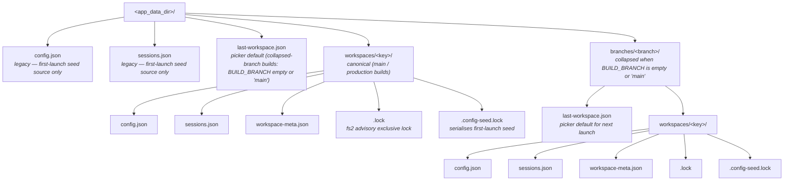

# Arborist — Design Document
_Version 0.5_

## 1. Technology Stack

| Layer | Choice | Rationale |
|-------|--------|-----------|
| Framework | **Tauri v2 (Rust)** | Cross-platform desktop app with a tiny binary (~5–15 MB), native OS WebView, memory-safe Rust backend. No bundled Chromium. |
| UI | **React + TypeScript** | Component-driven, strong typing, large community. Runs inside the OS WebView. |
| Terminal emulator | **xterm.js** | De-facto standard for web/desktop terminal rendering. Works in any WebView. |
| PTY backend | **portable-pty** (Rust crate) | Unified cross-platform PTY API (Windows ConPTY + Unix PTY) from the WezTerm project. Production-proven. |
| State management | **Zustand** | Lightweight, minimal boilerplate, good for session state. |
| Styling | **Tailwind CSS** | Utility-first; fast iteration for layout-heavy UI. |
| Build / bundle | **Vite + Tauri CLI** | Fast HMR for the frontend; Cargo for the Rust backend. |
| Persistence | **tauri-plugin-store** | JSON file-backed store exposed to the frontend via Tauri commands. |
| OS dialogs | **tauri-plugin-dialog** | Native file/directory picker; gated by the `dialog:allow-open` capability. Used by the New-Session flow's manual "Browse…" fallback (Phase 10). |

## 2. Architecture Overview

```
┌─────────────────────────────────────────────────────┐
│                   Tauri Rust Backend                │
│  ┌───────────┐  ┌──────────────┐  ┌──────────────┐  │
│  │ PTY Pool  │  │ Config Store │  │   Commands   │  │
│  └───────────┘  └──────────────┘  └──────────────┘  │
│        │           (tauri-plugin-store)      │        │
│        │            Tauri Commands / Events  │        │
├────────┼──────────────────────────────────────┼──────┤
│        ▼            OS WebView               ▼       │
│  ┌──────────────────────────────────────────────┐    │
│  │                React App                      │    │
│  │  ┌──────────┐  ┌─────────────────────────┐   │    │
│  │  │ Sidebar  │  │   Terminal Viewport      │   │    │
│  │  │ (Tabs)   │  │   (xterm.js instances)   │   │    │
│  │  └──────────┘  └─────────────────────────┘   │    │
│  └──────────────────────────────────────────────┘    │
└─────────────────────────────────────────────────────┘
```

### 2.1 Rust Backend Responsibilities

- **PTY Pool**: Manages `portable-pty` instances. One PTY per session. Responsible for composing the session's shell invocation (pre-launch commands joined with `&&` followed by the CLI launch command), spawning the PTY with that composed invocation in the worktree directory, handling resize and data relay, restarting on demand, and kill. PTY output is streamed to the frontend via Tauri events.
- **Config Store**: Reads/writes settings and session state to disk via `tauri-plugin-store`.
- **Commands**: Exposes a typed, capability-gated API to the frontend via Tauri `#[command]` handlers. Replaces the Electron `contextBridge` / `ipcMain` pattern.

### 2.2 Frontend Responsibilities

- **Sidebar component**: Renders vertical tabs, handles new-session flow, tab switching.
- **Terminal Viewport**: Hosts `xterm.js` Terminal instances. Only the active session's terminal is attached to the DOM; others are detached but keep their PTY alive in the Rust backend.
- **`use-terminal` hook**: Encapsulates the lifecycle of an `xterm.js` Terminal instance — initialization, attachment/detachment from the DOM, resize observation via `ResizeObserver`, and binding/unbinding of the PTY data stream via Tauri events.

## 3. Data Model

The data model is defined in Rust (serialized via `serde`) and mirrored as TypeScript types in the frontend.

Two distinct types are used for Session: the full `Session` (Rust-internal, persisted to the store) and the `SessionView` (sent to the frontend). `composedCommand` and `tempFiles` are backend-only — the frontend has no UI use for the raw shell command string or the on-disk temp-file specs and does not need them.

### 3.1 Session (Rust-internal / persisted)

```rust
struct Session {
    id: String,                  // UUID
    tool: Tool,                  // Claude | Copilot
    worktree_path: PathBuf,      // Canonicalized absolute path to the worktree directory
    worktree_name: String,       // Display name (basename of path)
    label: String,               // Tab label (worktreeName, or "worktreeName N" for duplicates)
    instruction_set_id: Option<String>,  // Optional reference to an InstructionSet. None means
                                         // the session was launched without a user-curated overlay
                                         // (the CLI still auto-discovers repo instructions from cwd).
    composed_command: String,    // Full shell command string — backend-only; used for restart
    status: SessionStatus,       // Starting | Running | Exited | Error
    pid: Option<u32>,            // OS PID of the PTY process; cleared on exit
    created_at: i64,             // Unix timestamp
    tab_index: usize,            // Display order in the sidebar
    temp_files: Vec<TempFileSpec>, // Backend-only; on-disk artefacts the session owns
                                   // (e.g. Claude's --system-prompt file). Persisted so
                                   // respawn_existing can rematerialise them after a
                                   // crash/restart. Omitted from SessionView.
    ai_session_id: Option<String>, // Backend-only; the underlying CLI's session id
                                   // (Claude's JSONL stem; Copilot's
                                   // session-state uuid). For Copilot
                                   // **pre-allocated at session_create**
                                   // (and reallocated on session_restart)
                                   // because `copilot --resume <uuid>`
                                   // creates a fresh session at any uuid;
                                   // for Claude it is **discovered** from
                                   // the transcript by the metrics watcher
                                   // post-spawn. Persisted so
                                   // restore_all_sessions can append
                                   // `--resume <id>` and continue the
                                   // conversation across an app restart.
                                   // Cleared on session_create for Claude;
                                   // populated on session_create for
                                   // Copilot.
}

struct TempFileSpec {
    path: PathBuf,
    contents: String,
}
```

### 3.1.1 SessionView (sent to frontend)

`composedCommand` and `tempFiles` are intentionally omitted. The frontend receives only what it needs to render the UI.

```typescript
interface SessionView {
  id: string;
  tool: 'claude' | 'copilot';
  worktreePath: string;
  worktreeName: string;
  label: string;
  instructionSetId?: string;
  status: 'starting' | 'running' | 'exited' | 'error';
  pid?: number;
  createdAt: number;
  tabIndex: number;
}
```

### 3.2 InstructionSet

```typescript
interface InstructionSet {
  id: string;
  name: string;
  tool: 'claude' | 'copilot';
  filePath: string;   // Path to the instructions file on disk
  isDefault: boolean;
}
```

### 3.3 AppConfig

```typescript
interface AppConfig {
  configVersion: number; // On-disk schema version (currently 4; bumped on breaking changes)
  defaultInstructionSets: {
    claude: string; // InstructionSet ID
    copilot: string; // InstructionSet ID
  };
  instructionSetsDir: string; // Path to directory containing instruction files
  workspaceRoot: string | null; // Single anchor repo (Roadmap §1); takes precedence over worktreeRoots
  worktreeRoots: string[]; // Legacy: additional repo roots to scan (kept for forward compatibility)
  prelaunchCommands: string[]; // Global commands run before CLI launch
  worktreePrelaunchCommands: Record<string, string[]>; // Per-worktree overrides (key = worktree path)
  aiLaunchCommands: { claude: string; copilot: string }; // Per-tool CLI override; empty string = default
  lastOpenSessions: string[]; // Session IDs to restore on next launch
  tabOrder: string[]; // Session IDs in sidebar display order
  activeSessionId: string | null; // Focused session at last shutdown (restored on launch)
}
```

`AppConfig` and the companion `sessions.json` no longer live directly under the
OS `app_data_dir`. Both files are scoped per **(branch, workspace)** so that
parallel Arborist instances — a release host plus any number of dev builds in
worktrees — cannot silently clobber each other's settings:



The branch axis is keyed off the build-time `BUILD_BRANCH` (`build.rs`); the
workspace axis is keyed off a deterministic hash of the canonicalised workspace
root. The path layer is implemented in `src-tauri/src/store_layout.rs`. The
locking + scoping wrapper is in `src-tauri/src/workspace_lock.rs` and
`src-tauri/src/workspace_scope.rs`. Atomic write semantics, quarantine
behaviour, and the seed-on-first-launch flow for both files are documented in
`dev/docs/CONFIGURATION.md`.

## 4. Component Hierarchy

```
<App>
  <Sidebar>
    <SidebarTab />       // One per session (icon + worktree name)
    <SidebarTab />
    <NewSessionButton />
  </Sidebar>
  <MainArea>
    <TerminalView />     // Active session's xterm.js instance
  </MainArea>
  <NewSessionDialog />   // Modal: tool picker → worktree picker → confirm
</App>
```

## 5. Key Flows

### 5.1 Create Session

```
User clicks [+]
  → NewSessionDialog opens
  → User selects tool (Claude | Copilot)
  → User selects worktree (from detected worktrees list or OS file picker)
        ↳ Detected list comes from `worktrees_list { repoRoot }`, which runs
          through the injectable `GitRunner` seam (production: shells out
          to `git worktree list --porcelain`, parsed in
          `src-tauri/src/git.rs`). Discovery failures degrade to an empty
          list, so the manual "Browse…" button (powered by
          `tauri-plugin-dialog`) is always available.
  → User optionally selects instruction set (default pre-selected)
  → Frontend invokes Tauri command: session_create { tool, worktreePath, cols, rows } (instructionSetId is optional and currently never sent by the new-session wizard; cols/rows are measured from the host before invocation, see §5.5b)
  → Rust backend:
      1. Creates Session record; assigns label — appends " N" suffix if a session
         with the same tool + worktreePath already exists (e.g., "my-feature 2")
      2. Resolves user's default shell and platform shell flag:
           macOS / Linux: $SHELL,   flag "-c"
           Windows:       %COMSPEC%, flag "/c"
      3. Merges global prelaunchCommands with any worktree-specific overrides
      4. Builds CLI launch command (see §5.6 — CLI Launch Commands)
      5. Composes command string: [...prelaunchCmds, cliCmd].join(' && ')
      6. Stores composedCommand on Session record (used for restart)
      7. Spawns PTY via portable-pty:
           PtySize { cols, rows }
           Command { program: shell, args: [shellFlag, composedCommand], cwd: worktreePath }
      8. Records pid on Session; sets status → 'starting'
      9. Spawns read thread: forwards PTY output to frontend via
           Tauri event: session://output { sessionId, data }
           The read thread applies backpressure: if the pending event queue
           exceeds a threshold (default: 512 events), output is buffered and
           flushed at a capped rate to prevent memory exhaustion from runaway
           CLI processes.
     10. Returns SessionView to frontend (composedCommand excluded)
  → Frontend:
      1. Creates xterm.js Terminal, subscribes to session://output events for this sessionId
      2. Adds SidebarTab for new session
      3. Switches active view to new terminal
```

### 5.2 Switch Session

```
User clicks a SidebarTab
  → Frontend detaches current xterm instance from DOM (keeps buffer)
  → Frontend attaches target session's xterm instance to DOM
  → Frontend invokes Tauri command: session_focus { sessionId }
  → Rust backend records active session (for restore-on-restart)
```

### 5.3 Close Session

```
User clicks [x] on a SidebarTab
  → Frontend shows confirmation dialog: "Terminate session '<label>'?"
  → User confirms
  → Frontend invokes Tauri command: session_close { sessionId }
  → Rust backend:
      1. Sends SIGTERM to PTY child process
      2. After grace period, sends SIGKILL if still alive
      3. Drops PTY handle; removes Session record from store
  → Frontend:
      1. Destroys xterm.js Terminal
      2. Removes SidebarTab
      3. Switches to adjacent session (or shows empty state)
```

### 5.4 Session Error & Restart

```
PTY process exits with non-zero code
  → Rust backend emits Tauri event: session://status { sessionId, status: 'error' }
  → Frontend:
      1. Marks tab with error indicator (e.g., red dot)
      2. Displays error overlay in terminal area with a "Restart" button

User clicks "Restart"
  → Frontend invokes Tauri command: session_restart { sessionId, cols, rows }
  → Rust backend:
      1. Re-spawns PTY using stored Session.composedCommand and Session.worktreePath
      2. Records new pid on Session; sets status → 'starting'
      3. Emits Tauri event: session://status { sessionId, status: 'starting' }
  → Frontend clears error overlay, re-attaches xterm.js to new PTY stream
```

User-initiated restart deliberately starts a fresh AI conversation —
the prior conversation id is *not* reused. For **Copilot** the backend
allocates a brand-new uuid and binds the new spawn to it via
`--resume <new-uuid>` (Copilot creates a fresh session at any uuid),
keeping the events.jsonl path deterministic across the restart. For
**Claude** the persisted `Session.aiSessionId` is cleared and the new
spawn runs without `--resume`; the metrics watcher repopulates the
field once the new transcript appears. In neither case is the
persisted `Session.composedCommand` mutated by this augmentation.

### 5.5 Session Restore on Launch

```
Tauri setup (backend)
  → initialise plugins, build PtyPool with the production spawner,
    run cleanup_orphans(), register managed state. Window opens.
  → (No sessions are spawned yet.)

App.tsx mounts (frontend)
  → configStore.hydrate()           (reads AppConfig from store)
  → sessionStore.hydrate()          (calls session_list — returns the
                                     persisted snapshot as-is, sorted by
                                     tabIndex; statuses come back exactly
                                     as last persisted, which may include
                                     a stale Running from a prior crash —
                                     restore_all_sessions resolves it
                                     below)
  → initTerminalRouter()            (attaches global session://output)
  → subscribeToStatus()             (attaches global session://status)
  → frontendReady()                 (one-shot CAS on the backend; awaits restore registration before resolving)
       └─ backend dispatches restore_all_sessions to a blocking thread
          and *awaits* its completion before frontend_ready returns:
           for each persisted Session in tabOrder order it
             1. (re-)materialises any persisted temp_files,
             2. flips the persisted status to Starting and emits
                session://status,
             3. registers the Session in the backend's `pending_spawn`
                claim map. The actual PTY spawn is deferred until the
                frontend issues its first `session_resize` for that
                session id (see §5.5b) so the CLI's first paint sees
                the host-measured cols/rows rather than the OS-default
                80×24. If `Session.aiSessionId` is set the registered
                entry's `composedCommand` is *augmented* (not
                recomposed) by appending `--resume <quoted-id>` to the
                trailing CLI invocation so the AI conversation continues
                across the restart. For **Copilot** the splice is
                unconditional — `--resume <unknown-uuid>` is safe
                (Copilot creates a fresh session at that uuid if the
                on-disk `~/.copilot/session-state/<id>/` directory has
                not been materialised yet, e.g. because the previous
                run crashed before the first `session.start` flush).
                For **Claude** a preflight checks
                `~/.claude/projects/<encoded-cwd>/<id>.jsonl`; if the
                transcript is missing the splice is dropped and the
                stored id is cleared so the user gets a clean fresh
                conversation rather than a Claude-side error. The
                persisted `Session.composedCommand` is never mutated
                by this augmentation — the splice happens on the
                spawn-time copy registered into `pending_spawn` only.
           Temp-file or status-update failures map per-session to Error
           and never abort the loop. Awaiting restore creates the
           happens-before edge that the frontend's first
           `session_resize` (issued synchronously by `attachToHost`
           → `refitEntry` once `setStatus('ready')` triggers MainArea
           to mount) needs in order to find the pending entry.
  → first session in tabOrder remains the active session
```

This ordering guarantees:

- The window is interactive within the SPEC NF-03 startup budget. Restore
  registration is bounded — disk IO + HashMap inserts only — so awaiting
  it does not blow the budget.
- `session://output` and `session://status` listeners are attached
  *before* any spawn happens, so early output and status events cannot
  be lost.
- Restore is driven by the Rust backend (`restore_all_sessions`), not by
  re-invoking `session_create` from the frontend — the frontend never
  has to reconstruct a `composedCommand`.
- The PTY child's first paint (splash, prompt) sees the actual host
  cols/rows the user will see, not the historical 80×24 default — see
  §5.5b for the deferred-spawn rationale.


### 5.5b Deferred-spawn-on-first-resize (avoiding the splash-too-narrow bug)

A pre-fix bug: every PTY was opened at a hardcoded 80×24 default, even
on hosts that ended up rendering at e.g. 114 cols. The CLI's first paint
(splash, first prompt) was drawn at 80 cols and sat permanently in
xterm's scrollback at the wrong layout — Copilot's splash logo broke
visibly, prompt input columns drifted, etc.

The fix plumbs the host's actual cols/rows into the spawn at every
entrypoint:

- **`session_create`** and **`session_restart`**: the frontend measures
  its host *before* invoking the command (`measureInitialPtyDimensions`
  in `src/hooks/use-terminal.ts`) and passes `cols`/`rows` in the args.
  The backend forwards the same `PtySize` straight to
  `PtySpawner::spawn` — no default fallback in the live spawn path.
- **`restore_all_sessions`**: the host doesn't yet exist when restore
  runs (the frontend hasn't laid out MainArea), so the spawn is
  *deferred*. Restore registers the prepared `Session` (already
  AI-resume-augmented if applicable) in `pending_spawn`. The first
  `session_resize` for that session id atomically `remove()`s the entry,
  spawns at the resize's `PtySize`, and starts the metrics watcher. A
  later resize hits the regular `pool.resize` path.

Race notes:
- `frontend_ready` awaits restore completion before resolving, so the
  frontend's first synchronous `session_resize` (from `attachToHost` →
  `refitEntry`) cannot lose the pending entry.
- A second resize that lands while the deferred spawn is still in flight
  may transiently get `NotFound` from `pool.resize`. The frontend logs
  and continues; the next ResizeObserver tick (debounced 50 ms) corrects.
  The window is short enough that we accept it rather than complicate
  the synchronisation further.


### 5.5c Workspace selection at boot and in-app switching

Arborist is **bound to one (branch, workspace) pair per process** — see §3.3
for the on-disk layout. Boot and in-app switching share a single
"acquire-or-fail" guarantee: every running Arborist instance holds an
exclusive `fs2` advisory lock on the `.lock` file inside its current
workspace directory. Two instances cannot bind the same pair concurrently.

**Boot**

1. The Rust setup hook resolves `BUILD_BRANCH` and the candidate workspace
   root, in priority order:
   - the `--workspace <path>` CLI argument, if present and valid;
   - the `branches/<branch>/last-workspace.json` hint (or the canonical
     `last-workspace.json` for a `main` build), if present and the path
     still exists;
   - otherwise `null`, which triggers the picker on the frontend side.
2. If a candidate is resolved, the backend tries to `bind_workspace` —
   creating the per-(branch, workspace) directory if needed, seeding
   `config.json`/`sessions.json` from the closest existing source under
   a `.config-seed.lock`, and acquiring the `.lock`.
3. On `WorkspaceLocked` (another Arborist instance already owns this
   pair), the backend exits with a non-zero status and a native dialog
   pointing the user at the conflicting build. There is **no** auto-fallback
   to a different workspace; data isolation is the load-bearing invariant.
4. If no candidate is resolved, the backend leaves `WorkspaceScope` empty
   and the frontend opens the workspace picker (`workspace_validate` is
   used to validate each candidate, including the advisory contention
   probe described in §6).

**In-app switch**

Triggered from the workspace indicator. The frontend invokes the
`workspace_switch` command with the new path. The backend uses **two**
concurrency primitives held on `AppContext`:

* `switch_lock: Arc<tokio::sync::RwLock<()>>` — a single writer-preferring
  lock. Workspace-scoped command handlers (`session_create`,
  `session_close`, `session_restart`, `session_focus`, `session_resize`,
  `config_set`, `frontend_ready`'s restore branch) take `try_read()` at
  their impl entry and hold the guard for the full impl body. The switch
  itself takes `write().await` at its impl entry and holds it for the full
  pipeline. Concurrent switches queue serially on the write side; in-flight
  handlers' read guards must drop before the write resolves.
* `switch_pending: Arc<AtomicUsize>` — incremented by the switch BEFORE
  awaiting `write()`, decremented when the switch returns (RAII via
  `SwitchPendingGuard`). Handlers use a **take-then-check** pattern:
  acquire `try_read()` first, then `load` the counter; if non-zero, drop
  the guard and reject. This closes a real race in tokio's `try_read`
  fairness — `try_read` consults only the current permit count, not the
  wait queue, so it can succeed while a writer is queued behind active
  readers. The counter is the source of truth for "a switch is in
  flight."

Lock-ordering discipline: `switch_lock` is the outermost lock; the
existing `workspace` `RwLock`, `pending_spawn` `Mutex`, and per-store
`write_lock` are taken briefly inside the read/write guard and released
before any `.await` not under the outer guard. There are no cycles.

Rejection semantics:

| Handler | On contention |
|---|---|
| `session_create` / `session_close` / `session_restart` / `session_focus` / `config_set` | `WorkspaceSwitchInProgress` (user-initiated, surfaces as a toast — but the frontend overlay disables UI during a switch so this is defence-in-depth) |
| `session_resize` | `Ok(())` silently — the next `ResizeObserver` fire after the switch completes corrects dimensions |
| `frontend_ready` (restore branch) | `Ok(())` silently — restore for the new workspace is now run inline by `workspace_switch` itself, so no second `frontend_ready` is needed |

The switch runs the steps in this order (matching
`workspace_switch_impl_inner`):

1. Bump `switch_pending` (RAII) and acquire `switch_lock.write().await`.
   The counter is set BEFORE awaiting the lock so handlers issued after
   this point reject (or silently `Ok`). The `write().await` then waits
   for in-flight read guards to drop before resolving. Both guards drop
   at function return (success or unwind).
2. `workspace_validate_impl(new_path, app_data_dir = None, branch)` —
   skip the advisory probe; the authoritative acquire below will surface
   the same contention as a hard error if it persists. Then canonicalise
   `new_path`.
3. **No-op fast path**: if the canonicalised path equals the currently
   bound workspace root, return `WorkspaceSwitchResult { workspaceRoot,
   noOp: true, config, sessions }` immediately, where `config` and
   `sessions` are loaded from the *current* (unchanged) store so the
   wire payload is non-nullable in every code path. The frontend
   short-circuits adoption on the `noOp` flag rather than branching on
   missing fields. No event is emitted, no other state mutates.
4. `bind_workspace(new)` — create the new per-(branch, workspace)
   directory if needed, run seed-on-first-launch under
   `.config-seed.lock`, and **acquire the new `.lock`**. On contention
   the switch aborts with `WorkspaceLocked`, both guards drop, and the
   old workspace remains bound.
5. **`ensure_workspace_root_in_config` on the NEW store — pre-swap,
   aborts the switch on failure.** Persists the new workspace's path
   into its own `config.json` *before* committing the scope swap. If
   this write fails, the early-return drops `binding` (releasing the
   newly-acquired OS lock), the old `WorkspaceScope` is still bound,
   and both `switch_lock` write guard and `switch_pending` counter
   release. This is the **asymmetric counterpart** to
   `boot_select_workspace`, which tolerates the same failure because
   boot is one-shot and the user can restart; mid-session switching
   cannot leave the backend bound to a workspace whose `config.json`
   reports `workspaceRoot: null`, because the post-switch frontend
   rehydrate would then fall back to the first-boot picker even though
   the swap had already committed — a self-contradictory state with no
   clean recovery.
6. **Drain the AI-discovery callback channel.** `pending_spawn.clear()`
   drops any deferred-spawn entry queued by the old workspace's
   restore, then `metrics.stop_all_and_join()` stops AND joins every
   metrics watcher thread. After this returns, no AI-session-discovery
   callback for an old session can fire again. Under the write guard
   no resize-deferred-spawn / restore can be in flight (their read
   guards have all dropped before our `write().await` resolved), so
   the join is deterministic, and no new watchers can be armed until
   we drop the write guard at function exit.
7. **Park** every live session — for each id in `store.load_sessions()`,
   drop any `pending_spawn` entry and best-effort `pool.kill(&id).await`.
   `pool.kill` sets `killed=true` (so `pty_wait_loop` skips its final
   status emit, see `pty_pool.rs`), awaits the bounded drain task, and
   joins the wait thread before returning — draining the PTY-status
   callback channel as a side effect. Park does **not** re-`stop` the
   per-session metrics watcher; step 6's `stop_all_and_join` already
   handled them, and under the write guard no new watcher can be armed
   between step 6 and step 7. The persisted record (`sessions.json`,
   `last_open_sessions`, `tab_order`, `active_session_id`) is **left
   untouched** so a later switch-back can revive the session via
   `restore_all_sessions` without losing tab state or AI conversation
   context (Claude/Copilot `--resume` is spliced at restore-spawn time
   per §5.5). Park is best-effort: a failed `pool.kill` only leaks a
   child PTY whose record stays in the store and will be re-spawned
   (and the orphan PTY harmlessly exits when the kernel reaps it on
   process exit). No abort path is needed because no irreversible
   store mutation happens here.
8. Atomically swap the `WorkspaceScope` (under `Arc<RwLock>`). The OLD
   `WorkspaceLockGuard` inside the old scope is dropped at this
   assignment, releasing the OS lock on the old workspace. Steps 6 and
   7 ensured the only callbacks that could still fire are post-emit
   Tauri event deliveries to the JS side (handled by the
   `NotFound`-tolerant store re-resolution in `commands::mod`). The
   `restored` atomic is **not** reset here — it is latched to `true` in
   step 10 after the inline restore completes, so a stray
   `frontend_ready` after the switch returns becomes a no-op CAS rather
   than a double-spawn trigger. (PR4's flow reset the atomic before the
   swap so that the frontend's follow-up `frontend_ready` could trigger
   restore; PR5 owns the restore inline, so an explicit reset would be
   wrong here.)
9. **Best-effort post-swap hint write.** Persist
   `branches/<branch>/last-workspace.json` (or the canonical
   `last-workspace.json` for a `main` build) via `write_hint`. The
   hint is only consulted at the *next* process boot to skip the
   picker; failure is logged and ignored. The single-source-of-truth
   `workspaceRoot` was already persisted in step 5 above, so the
   post-switch frontend rehydrate is correct regardless of whether
   this hint lands.
10. **Inline restore.** Run `restore_all_sessions` against the
    now-bound new workspace under the same write guard, via
    `tauri::async_runtime::spawn_blocking` (restore does blocking
    store IO + temp-file materialisation + `cleanup_orphans`). After
    restore completes, **latch `restored = true`** so a
    frontend-initiated `frontend_ready` cannot re-fire restore against
    the same workspace. The write guard is held for the entire restore
    so no new lifecycle handler can interleave; restore registers each
    session as a deferred-spawn entry whose `pool.spawn` fires from
    the first `session_resize` after the switch returns.
11. Build the post-switch snapshot — load `AppConfig` + the persisted
    `Vec<SessionView>` from the new store — and return
    `WorkspaceSwitchResult { workspaceRoot, noOp: false, config,
    sessions }`. Returning drops both guards (write lock +
    `switch_pending` decrement), allowing queued lifecycle handlers
    to proceed against the new scope.

The frontend treats the returned `{ config, sessions }` as
authoritative — it adopts both stores atomically in a single render
(see `lib/workspace-switch.ts::changeWorkspace`). Sessions belonging
to the old workspace are **parked** (PTYs killed, records preserved)
by step 7; the new workspace's sessions are restored inline by step 10
in the same call. Switching back to the original workspace later will
re-spawn its parked sessions via the same restore path, with AI
conversation context preserved through `compose::with_resume`.

If a parked session's worktree directory was deleted out-of-band while
parked (e.g. `git worktree remove` from another tool), the next
`restore_all_sessions` for that workspace silently drops the record
and trims the stale id from `last_open_sessions` / `tab_order` /
`active_session_id` rather than projecting a phantom "Error" tab.


### 5.6 CLI Launch Commands

Arborist builds the CLI portion of the composed command differently per tool.
The instruction set file path is always resolved to an absolute, canonicalized path
before use (Rust `std::fs::canonicalize()`), which resolves symlinks and prevents
directory-traversal via symlink attacks.

**Shell argument quoting**: All dynamic values inserted into the composed command
string (file paths, the `-i` context string) MUST be shell-quoted before
interpolation using a proper quoting function — not simple string wrapping — to
handle paths with spaces, quotes, or special characters on all platforms.
The worktree `cwd` is ALWAYS passed as a discrete `cwd` field to `portable-pty`,
never interpolated into the command string.

#### Claude

Claude automatically reads `CLAUDE.md` from the `cwd` (worktree) and walks up the
directory tree — this happens regardless of any flags and cannot be disabled. The
`--system-prompt` flag injects an *additional* system prompt on top of `CLAUDE.md`;
the two coexist without conflict.

Arborist *optionally* uses `--system-prompt` to pass the user's selected
instruction set file alongside a worktree context block. The context block is
prepended to the instruction set content and written to a session-scoped temp
file at session creation time:

```
Context block  (generated by Arborist — worktree label + path)
---
Instruction set file contents  (user's selected .md file)
```

The composed temp file is deleted when the session is closed.

```
claude --system-prompt <temp-instruction-file>
```

When no instruction set is attached to the session (the default for sessions
created through the new-session wizard), Claude is launched as bare `claude`
with no `--system-prompt` and no temp file. The agent still receives the
worktree as its `cwd`, so `CLAUDE.md` is auto-discovered and the agent can
derive its location from `pwd`/`git`.

`CLAUDE.md` (repo instructions) is loaded automatically by Claude from the worktree
`cwd` regardless of whether `--system-prompt` is supplied — Arborist does not need
to handle it.

#### Copilot

Copilot automatically reads `.github/copilot-instructions.md` from the repo root
when no `--instructions` flag is provided. Arborist deliberately omits
`--instructions` so that auto-discovery from `cwd` (the worktree) is preserved.

The modern `copilot` CLI starts in interactive mode by default. The legacy
`--interactive <string>` flag was removed and now triggers a "too many
arguments" error from the CLI, so Arborist spawns Copilot bare:

```
copilot
```

No worktree context preamble is injected; the agent can derive its location
from `pwd`/`git` (the PTY pool sets `cwd` to the worktree). No temp files are
created at compose time.

##### Per-session telemetry env (Copilot only)

Arborist enables Copilot's OpenTelemetry **file exporter** at spawn time so
the sidebar can surface real-time token usage and context-window state. The
PTY pool injects three environment variables into the spawned `copilot`
process (additive — the child still inherits the parent's env; Arborist
never calls `env_clear`):

| Variable | Value | Purpose |
|---|---|---|
| `COPILOT_OTEL_FILE_EXPORTER_PATH` | `<session_temp_dir>/otel.jsonl` | Redirects OTel spans to a per-session JSONL file Arborist tails (`session_metrics::run_copilot_watcher`). |
| `COPILOT_OTEL_ENABLED` | `true` | Activates the exporter. |
| `OTEL_BSP_SCHEDULE_DELAY` | `1000` | Standard OTel SDK env var; tightens the batch span processor flush from 5s to ~1s so the sidebar updates feel live. |

These values are computed by `compose::env_for_tool(tool, &session_id)` and
**not** persisted on `Session` — they are derived from the session id (which
*is* persisted) at every spawn / restart / restore. This keeps
`Session.composed_command` clean (it remains the same shell string we'd
write into the user's terminal if asked) and avoids stale paths leaking
across upgrades.

The pool also creates `<session_temp_dir>` if missing and removes any stale
`otel.jsonl` from a previous run before spawning, so restart / restore-on-
launch don't replay old spans and double-count totals.

| | Claude | Copilot |
|---|---|---|
| Repo instructions | Auto-loaded from `cwd` (`CLAUDE.md`) | Auto-loaded from `cwd` (`.github/copilot-instructions.md`) |
| Worktree context | `--system-prompt <temp-file>` (only when an instruction set is attached) | Not injected — agent derives from `pwd`/`git` |
| Instruction set | Included in temp file when attached; otherwise launches as bare `claude` | Not passed — Copilot uses its own instruction discovery |
| Compose-time temp file | Only when an instruction set is attached; cleaned up on session close | No |
| Telemetry env injected at spawn | None (Claude transcripts under `~/.claude/projects/` are read directly) | Three OTel env vars enable the file exporter (see above) |

## 6. Tauri Command & Event API

Frontend ↔ backend communication uses Tauri's typed command/event system. Commands
are invoked from the frontend via `invoke()`; events are pushed from the Rust backend
via `app_handle.emit()` and received in the frontend via `listen()`.

All commands are gated by Tauri capability declarations in `capabilities/main.json`.

### Commands (Frontend → Rust)

| Command | Payload | Return | Description |
|---------|---------|--------|-------------|
| `session_create` | `{ tool, worktreePath, instructionSetId?, cols, rows }` | `SessionView` | Compose and spawn a new session. `instructionSetId` is optional; when omitted, Claude is launched without `--system-prompt` and the CLI relies on `cwd`-based discovery for repo instructions. `cols`/`rows` are the frontend-measured initial PTY dimensions — required so the CLI's first paint matches the actual host width (see §5.5b). |
| `session_list` | — | `SessionView[]` | Return all current sessions (without composedCommand/tempFiles) |
| `session_close` | `{ sessionId, deleteWorktree? }` | `SessionCloseResult` | Terminate a session (after UI confirmation). When `deleteWorktree` is `true`, the backend additionally runs `git worktree remove --force <worktreePath>` after killing the PTY. Refuses to remove the configured `workspaceRoot` (main worktree), any path outside the workspace root, or a path still referenced by another live session. The session record + PTY are always torn down on success; if the worktree-remove step fails, the message is reported via `worktreeDeleteError` rather than as a hard error. |
| `session_focus` | `{ sessionId }` | — | Mark session as active |
| `session_resize` | `{ sessionId, cols, rows }` | — | Resize PTY |
| `session_input` | `{ sessionId, data }` | — | Send keystrokes to PTY |
| `session_restart` | `{ sessionId, cols, rows }` | — | Re-spawn a session using its stored `composedCommand` (DESIGN §5.4). `cols`/`rows` are the frontend-measured current PTY dimensions so the new child paints at the right size from the first byte (see §5.5b). The conversation id is rotated (Copilot: a freshly-allocated uuid is spliced via `--resume` on the spawn-time copy; Claude: cleared) so the new spawn is a fresh AI conversation by user contract. The persisted `Session.composedCommand` is never mutated. |
| `frontend_ready` | — | — | One-shot signal from the frontend after first paint; **awaits** restore-on-launch completion so the frontend's first `session_resize` is guaranteed to find the pending session entry registered (see §5.5/§5.5b). Idempotent — subsequent calls are no-ops. |
| `config_get` | — | `AppConfig` | Retrieve AppConfig |
| `config_set` | `Partial<AppConfig>` | — | Update AppConfig (`activeSessionId` is tri-state: omit to leave alone, `null` to clear, value to set) |
| `instructions_list` | — | `InstructionSet[]` | List available instruction sets from `instructionSetsDir` |
| `worktrees_list` | `{ repoRoot: string }` | `WorktreeInfo[]` | Enumerate git worktrees rooted at `repoRoot`. Implemented via the injectable `GitRunner` seam (production: `git worktree list --porcelain`, parsed in `src-tauri/src/git.rs`). **Always returns `Ok(vec![])` on failure** — git missing, repo_root not a directory, repo_root is not a git repository, or any IO/parse error degrades to an empty list (logged with `code="GitUnavailable"`) so the UI's "Browse…" fallback is never blocked by an error toast. `WorktreeInfo = { path, branch?, isMain, isLocked }`. |
| `workspace_validate` | `{ path: string }` | `{ valid: boolean, error?: string, alreadyOpenInAnotherInstance?: boolean }` | Validate a candidate workspace root for the first-boot picker (Roadmap §1.1) and the in-app workspace switcher (§5.5c). Returns `valid: true` only when `path` is an absolute, existing directory that is a **primary git repository root** — i.e. `git -C <path> rev-parse --show-toplevel` equals `path` itself **AND** `<path>/.git` is a *directory*. Linked git worktrees (where `.git` is a *file* containing `gitdir: <path-into-primary>`) and submodule working trees are explicitly rejected, because Arborist's session model spawns child worktrees from a primary repo root and a linked worktree cannot host its own worktrees (`git worktree add` from inside one fails). Subdirectories of a repo are also rejected (toplevel != path). On failure, `error` carries a short human-readable reason (`"path is not an absolute directory"`, `"not a git repository"`, `"path is a linked git worktree, not a primary repository root"`, `"path must be the repository root (...)"`, …). Never throws an `AppError` for the "invalid" case — the picker shows inline feedback. The same rules are enforced at boot by `crate::boot::validate_repo_root`; the two MUST stay in sync. **`alreadyOpenInAnotherInstance` is an advisory contention probe** (set only when the caller can supply an `app_data_dir` — i.e. the public Tauri command path; internal in-app callers pass `None` and leave the field as `undefined`). When set, it is the result of a non-destructive `WorkspaceLockGuard::probe` against the per-(branch, workspace) `.lock` file: `true` ⇒ another Arborist instance is currently bound here, `false` ⇒ free at probe time, `undefined` ⇒ no probe was performed. The signal is purely advisory — there is an inherent race window between probe and the authoritative acquire performed by `bind_workspace`/`workspace_switch`. The picker MUST render this as a warning and NOT a hard block; persistent contention surfaces later as a `WorkspaceLocked` error from the acquire. |
| `workspace_switch` | `{ path: string }` | `{ workspaceRoot: string, noOp: boolean, config: AppConfig, sessions: SessionView[] }` | Atomically swap the running process from the current (branch, workspace) pair to the new one identified by `path` (§5.5c). The full transaction (validate → no-op fast path → acquire new lock → **persist `workspaceRoot` into new `config.json` (aborts switch on failure)** → drain AI-discovery callbacks (`metrics.stop_all_and_join`) → **park** old sessions (`pool.kill` drains PTY-status callbacks; persisted records are preserved) → swap `WorkspaceScope` → best-effort persist hint → **inline `restore_all_sessions` for the new workspace under the same write guard** → latch `restored = true` (the gate is **not** reset before restore — restoring inline means latching to true at the end is the only correct transition; see §5.5c step 8) → load `{ config, sessions }` from the new store) runs under a `tokio::sync::RwLock<()>` write guard (`switch_lock`) held for the entire function body, paired with an `AtomicUsize` counter (`switch_pending`) bumped before the lock is awaited. The pair quiesces in-flight workspace-mutating handlers before the swap and rejects new ones with `WorkspaceSwitchInProgress` for the duration; concurrent switches queue serially on the write side. Returns `noOp: true` (no work done; `config` + `sessions` reflect the unchanged state) when `path` canonicalises to the currently bound root. Returns `WorkspaceLocked` on lock-contention with the old workspace still bound; the frontend should surface this as a hard error. On success (`noOp: false`), the frontend adopts the returned `config` + `sessions` atomically into both stores in a single render (`lib/workspace-switch.ts::changeWorkspace` → `configStore.adoptWorkspace` + `sessionStore.actions.adoptWorkspace`); no second round-trip and no `workspace://changed` event are needed. **Park semantics**: the old workspace's `sessions.json`, `last_open_sessions`, `tab_order`, and `active_session_id` are left untouched, so a later switch-back resurrects every session at its previous position with Claude/Copilot `--resume` keeping AI conversation context alive (§5.5c step 7). |
| `worktree_create` | `{ name: string }` | `{ path: string }` | Create a new linked worktree at `<workspaceRoot>/.worktrees/<name>` on a fresh branch named `<name>` (Roadmap §2.2). Requires `workspaceRoot` to be set in `AppConfig`; errors with `NotFound` otherwise. The `name` is re-validated server-side via the same rules as `validateWorktreeName` (no spaces; no `..`, `~`, `^`, `:`, `?`, `*`, `[`, `\\`; cannot start/end with `.` or `/`; cannot end with `.lock`; cannot be `@`; 1–255 chars); `InvalidPath` is returned for any rule violation. Runs `git -C <workspaceRoot> worktree add .worktrees/<name> -b <name>` via the injected `GitRunner`; bubbles up the captured stderr in the `Internal` error message on git failure. Returns the canonical absolute path to the new worktree directory. |

> **Test-only seam.** The Rust backend consults two env vars,
> `ARBORIST_CLI_OVERRIDE_CLAUDE` and `ARBORIST_CLI_OVERRIDE_COPILOT`, when composing
> a session's command. If set, the value replaces the bare `claude` / `copilot`
> program token (already shell-quoted). Production never sets these; they exist
> only so integration tests can drive the full lifecycle against a deterministic
> child process. The override path is encoded verbatim into the persisted
> `composedCommand`, so restarting the session with the env var unset will spawn
> the literal path (not fall back to `claude`/`copilot`). See
> `compose::cli_program_for_tool`.

### Events (Rust → Frontend)

| Event | Payload | Description |
|-------|---------|-------------|
| `session://output` | `{ sessionId, data: string }` | Stream PTY output to xterm.js |
| `session://status` | `{ sessionId, status }` | Notify session state changes (including `'error'`) |
| `session://activity` | `{ sessionId, kind: 'title' \| 'attention' \| 'working' \| 'idle' \| 'promptStart' \| 'commandStart' \| 'commandEnd' \| 'turnStart' \| 'turnEnd' \| 'toolStart' \| 'toolEnd' \| 'awaitingPermission' \| 'permissionResolved', value?, exit?, durationMs?, toolName?, toolCallId?, success?, requestId?, permissionKind?, summary?, approved? }` | Per-session activity. Two sources: (1) the legacy PTY-byte scanner in `src-tauri/src/activity.rs` (OSC parsing + output byte-rate) emits `title`/`attention`/`working`/`idle`/`promptStart`/`commandStart`/`commandEnd` for **all** tools; (2) the Copilot `events.jsonl` tailer in `src-tauri/src/copilot_events.rs` emits the richer `turnStart`/`turnEnd`/`toolStart`/`toolEnd`/`awaitingPermission`/`permissionResolved` variants for Copilot sessions whose `ai_session_id` is known. The frontend reducer keeps both axes — they're additive; the `selectDisplayStatus` priority order is `error > starting > exited > awaitingPermission > attention > runningTool > thinking > working > awaiting > idle`. Best-effort & advisory — UI must degrade gracefully if a CLI emits nothing. |
| `session://metrics` | `{ sessionId, model?, contextUsedPct?, contextTokensUsed?, contextTokensLimit?, inputTokens?, outputTokens?, observedAt }` | Per-session token usage / context-window utilization. Emitted by `src-tauri/src/session_metrics.rs`, which polls Claude's `~/.claude/projects/<encoded-cwd>/<sid>.jsonl` transcripts (heuristic cwd+mtime mapping) and extracts cumulative `usage` from the latest assistant turn. Claude-only in v1; Copilot tabs receive no events. Drives the compact second line on each sidebar tab. Best-effort & debounced — UI must degrade gracefully when no snapshot is present. |

> **Removed in PR5 (settings-flush):** `workspace://changed` no longer
> exists. State transfer for an in-app workspace switch happens inline
> on the `workspace_switch` reply (`{ config, sessions }`); see the
> `workspace_switch` row above and §5.5c.

### Plugin commands routed via the bridge

`src/lib/tauri-bridge.ts` also wraps one third-party plugin command so
that callers stay on the single bridge surface (no direct
`@tauri-apps/plugin-*` imports from components):

| Bridge function | Underlying plugin call | Capability | Purpose |
|-----------------|------------------------|------------|---------|
| `pickDirectory()` | `tauri-plugin-dialog`'s `open({ directory: true, multiple: false })` | `dialog:allow-open` | Native OS directory picker; powers the New-Session dialog's manual "Browse…" fallback when `worktrees_list` returns nothing useful (SPEC W-03). |

The `dialog:allow-open` permission is declared in
`src-tauri/capabilities/main.json`; the plugin itself is initialised in
`arborist_lib::run`. Adding any further plugin command must follow the same
capability + bridge-wrapper + mock-stub discipline (see
[`TESTING.md`](./TESTING.md) §6).

## 7. Directory Structure (Proposed)

```
arborist/
├── dev/
│   └── docs/
│       ├── SPEC.md
│       └── DESIGN.md
├── src/                          # React frontend (Vite)
│   ├── main.tsx
│   ├── App.tsx
│   ├── components/
│   │   ├── Sidebar.tsx
│   │   ├── SidebarTab.tsx
│   │   ├── NewSessionButton.tsx
│   │   ├── NewSessionDialog.tsx
│   │   ├── MainArea.tsx
│   │   └── TerminalView.tsx
│   ├── store/
│   │   └── session-store.ts
│   ├── hooks/
│   │   └── use-terminal.ts
│   ├── lib/
│   │   └── tauri-bridge.ts       # Typed wrappers around invoke() and listen()
│   └── assets/
│       ├── claude-icon.svg
│       └── copilot-icon.svg
├── src-tauri/                    # Rust backend (Cargo)
│   ├── src/
│   │   ├── main.rs
│   │   ├── pty_pool.rs           # portable-pty session management
│   │   ├── config_store.rs       # tauri-plugin-store wrapper
│   │   ├── commands.rs           # #[tauri::command] handlers
│   │   ├── activity.rs           # PTY-byte scanner (OSC + byte-rate)
│   │   ├── session_metrics.rs    # Token/context-window watcher (Claude JSONL + Copilot OTel)
│   │   ├── copilot_events.rs     # Copilot ~/.copilot/session-state/<aid>/events.jsonl tailer
│   │   └── types.rs              # Session, InstructionSet, AppConfig (serde)
│   ├── capabilities/
│   │   └── main.json             # Tauri capability declarations
│   ├── Cargo.toml
│   └── tauri.conf.json
├── instructions/                 # Default instruction set files
│   ├── claude-default.md
│   └── copilot-default.md
├── package.json
├── tsconfig.json
└── vite.config.ts
```

## 8. Security Considerations

Arborist is a local, single-user desktop application. It makes no inbound or
outbound network connections and is not exposed to untrusted content. The primary
concerns are (a) bugs in Arborist's own command-building logic causing unintended
shell execution, and (b) robustness against bad input and resource exhaustion.

### 8.1 Shell Command Correctness

The most consequential class of bug would be Arborist constructing a malformed
shell command that runs something unintended on the user's machine.

- **Shell argument quoting**: Dynamic values inserted into the composed command string
  (instruction file paths, the Copilot `-i` context string) must be properly
  shell-quoted — not simply wrapped in double quotes — to handle paths with spaces,
  single quotes, or backslashes correctly on all platforms.
- **Config-only sources**: Pre-launch commands and CLI launch arguments are built
  exclusively from validated config values. No free-form user input from the UI is
  interpolated into a shell command.
- **`prelaunchCommands` execute as the user**: Users who configure `prelaunchCommands`
  are intentionally running shell commands. The session creation dialog displays the
  active pre-launch commands so users can review them before confirming.

### 8.2 Path & File Robustness

- **Path canonicalization**: Worktree and instruction file paths are resolved via
  `std::fs::canonicalize()` before use, normalizing `..` components and resolving
  symlinks. This prevents bugs where relative or indirect paths cause files to be read
  from unexpected locations.
- **Instruction file confinement**: After canonicalization, instruction file paths must
  lie within `instructionSetsDir`. Paths outside are rejected.
- **Worktree validation**: Worktree paths must exist and be directories before a session
  is created or restored. Stale paths (e.g., from a deleted worktree) produce a clear
  error rather than a confusing PTY failure.
- **Instruction file size cap**: Instruction files are capped at 1 MB to prevent
  accidental exhaustion from an unexpectedly large file.
- **Temp file cleanup (Claude)**: Session-scoped temp instruction files are deleted on
  session close. On startup, orphaned temp files from a previous crash are cleaned up.

### 8.3 Resource Management

- **PTY output backpressure**: The PTY read thread streams bytes through a bounded
  `tokio::sync::mpsc` channel (capacity: 512 chunks, see
  `pty_pool::OUTPUT_CHANNEL_CAPACITY`). When the channel is full, the read thread
  **drops the new chunk** (newest-first) and increments a per-session counter; a warning
  is logged every 256 drops. This prevents memory exhaustion if a CLI process produces
  runaway output (e.g., a verbose build or a `yes` loop).
- **ANSI reset after a drop**: Because dropping a partial output chunk could leave
  xterm.js mid-escape-sequence, the read thread prepends `ESC c` (full terminal reset)
  to the **next** successfully-sent chunk after a drop. Tests assert this in
  `tests/pty_pool.rs::backpressure_drops_chunks_and_inserts_reset_after_drain`.
- **Streaming UTF-8 decode**: PTY bytes are decoded incrementally, holding at most the
  three trailing bytes of a partial multibyte sequence between reads, so a multibyte
  scalar split across two `read()` calls is never truncated or replaced.
- **Orphan temp-dir cleanup**: On startup, `pty_pool::cleanup_orphans` scans
  `<os-temp>/arborist/<uuid>/` and deletes any UUID-named directory whose UUID is not in
  the persisted session list **and** whose mtime is older than 1 hour
  (`pty_pool::ORPHAN_AGE_THRESHOLD`). The age threshold prevents racing against an
  in-flight session whose temp file was just written; the persisted-set check makes
  cleanup restore-safe.
- **Scrollback cap**: xterm.js is configured with a `scrollback` limit (default:
  5 000 lines) to bound per-session memory in the frontend.

### 8.4 Credential Handling

Arborist stores no credentials. Authentication is managed entirely by the CLI tools
(`claude`, `copilot`) via their own credential stores. The app neither reads nor writes
tokens, API keys, or passwords.

## 9. Future Considerations

- **Split view**: Show two terminals side by side.
- **Worktree auto-discovery**: Deeper scanning (e.g., recursive search, multiple remotes). _(Basic discovery anchored on `workspaceRoot` — and its legacy `worktreeRoots` companion — is included in v1; see `WORKTREES.md`.)_
- **Session snapshots**: Save/restore terminal scrollback.
- **Theming**: Respect system dark/light mode and allow custom terminal themes.
- **Keyboard shortcuts**: Ctrl+Tab to cycle sessions, Ctrl+N for new session.
- **In-app instruction set editor**: Create and edit instruction files without leaving the app.
