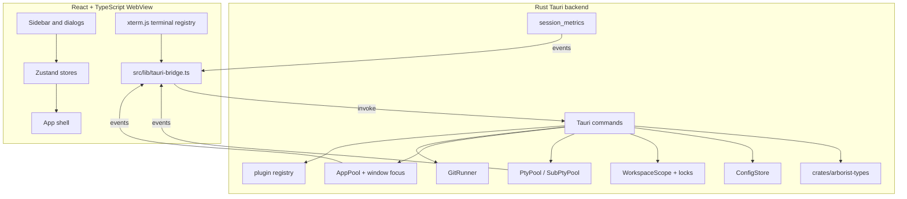

# Architecture

Arborist is a Tauri v2 desktop app. The Rust backend owns process lifecycle, PTYs, config, workspace locking, Git integration, and persistence. The
React frontend owns rendering, local UI state, xterm.js terminal objects, settings forms, and event subscriptions.

## System shape

## Repository map

| Path                     | Purpose                                                                                                                                 |
| ------------------------ | --------------------------------------------------------------------------------------------------------------------------------------- |
| `src/`                   | React/TypeScript frontend. Components, hooks, stores, plugins, bridge wrappers, and TS wire types.                                      |
| `src-tauri/src/`         | Rust backend. Tauri entrypoint, command implementations, PTY pools, config store, workspace locks, Git helpers, metrics, and launchers. |
| `crates/arborist-types/` | Canonical serialized wire and persistence types shared by backend code and mirrored manually in `src/types/arborist.ts`.                |
| `docs/`                  | Active project documentation.                                                                                                           |
| `dev/e2e/linux/`         | Dockerized Linux E2E harness.                                                                                                           |
| `.github/workflows/`     | CI, approval-gated Rust checks, and release workflow.                                                                                   |

## Backend modules

| Module                                                    | Responsibility                                                                                                                      |
| --------------------------------------------------------- | ----------------------------------------------------------------------------------------------------------------------------------- |
| `lib.rs`                                                  | Tauri app setup, tracing, workspace boot binding, plugin registry, managed state, command registration, and production sink wiring. |
| `boot.rs`                                                 | CLI parsing, boot-time workspace resolution, primary-clone validation, native failure dialogs, and workspace binding.               |
| `store_layout.rs`                                         | Per-branch and per-workspace app-data path layout.                                                                                  |
| `workspace_lock.rs`                                       | `fs2` advisory lock for one process per `(branch, workspace)` store.                                                                |
| `workspace_scope.rs`                                      | Current workspace binding and `ConfigStore` handle.                                                                                 |
| `config_store.rs`                                         | Atomic JSON persistence, migrations, quarantine, config merge, session records, and worktree tabs.                                  |
| `commands/mod.rs`                                         | Thin `#[tauri::command]` wrappers and production event sinks.                                                                       |
| `commands/session.rs`                                     | Session, workspace, worktree-create, restore, and switch implementation logic.                                                      |
| `commands/worktree_tab.rs`                                | Worktree tab open, close, focus, reorder, and active-child logic.                                                                   |
| `commands/subsession.rs`                                  | Custom-process sub-session lifecycle and restore logic.                                                                             |
| `commands/mcp.rs`, `mcp/`                                 | MCP config/status commands, audit/trust/confirmation state, and authenticated local-socket host IPC scaffolding.                    |
| `compose.rs`                                              | CLI command composition, path validation, worktree-name validation, shell quoting, and tool-specific launch behavior.               |
| `session_temp.rs`                                         | Hardened per-session temp directory and Copilot OTel file creation, reset, orphan cleanup, and symlink/reparse refusal.             |
| `pty_pool.rs`                                             | PTY spawn/read/write/resize/kill, deferred spawn, backpressure, wait threads, and orphan cleanup.                                   |
| `sub_sessions.rs`                                         | Parallel PTY/app runtime for custom-process sub-tabs.                                                                               |
| `app_launcher.rs`                                         | Detached application process spawning and app close/kill support.                                                                   |
| `window_focus.rs`                                         | Platform-specific focus implementation for application sub-sessions.                                                                |
| `git.rs`                                                  | `GitRunner` seam and parsing of `git worktree list --porcelain`.                                                                    |
| `worktree_prep.rs`                                        | One-shot prep process spawning, logging, and `worktree://prep` events.                                                              |
| `session_metrics.rs`                                      | Claude/Copilot metrics watchers, AI session id discovery, and activity event generation.                                            |
| `plugins/`                                                | Built-in AI, custom-process, and dashboard-widget plugin registration.                                                              |
| `process_icon.rs`, `icon_backfill.rs`, `worktree_icon.rs` | Icon extraction, cached icon data URIs, and worktree icon assignment.                                                               |

## Frontend modules

| Module                            | Responsibility                                                                                        |
| --------------------------------- | ----------------------------------------------------------------------------------------------------- |
| `src/App.tsx`                     | Boot orchestration, global event subscriptions, workspace picker, shell layout, and providers.        |
| `src/lib/tauri-bridge.ts`         | The only frontend import surface for Tauri `invoke` and `listen`.                                     |
| `src/lib/tauri-bridge.mock.ts`    | Test mock that must satisfy the bridge module shape.                                                  |
| `src/types/arborist.ts`           | TypeScript mirror of `crates/arborist-types/src/lib.rs`.                                              |
| `src/hooks/use-terminal.ts`       | xterm.js lifecycle, terminal registry, attach/detach, resize, PTY input, and output routing.          |
| `src/store/session-store.ts`      | Session list, active state, status, metrics, and activity display state. PTY output bypasses Zustand. |
| `src/store/config-store.ts`       | App config cache backed by `config_get` and `config_set`.                                             |
| `src/store/worktree-tab-store.ts` | Top-level worktree tab state and active child selection.                                              |
| `src/lib/workspace-switch.ts`     | Frontend adoption flow for `workspace_switch` results.                                                |
| `src/components/*`                | Sidebar, worktree dashboard, dialogs, settings, terminal views, and context menus.                    |
| `src/plugins/*`                   | Frontend plugin registry and built-in plugin renderers.                                               |

## Data model

The canonical Rust definitions live in `crates/arborist-types/src/lib.rs`. The TypeScript mirror lives in `src/types/arborist.ts`. Any change to a
Rust wire/persistence type must update the TypeScript mirror in the same commit.

| Type               | Stored where            | Sent to frontend | Purpose                                                                                                                            |
| ------------------ | ----------------------- | ---------------- | ---------------------------------------------------------------------------------------------------------------------------------- |
| `Session`          | `sessions.json`         | No               | Full backend record for an AI PTY session. Includes `composedCommand`, temp files, AI session id, and last-known metrics snapshot. |
| `SessionView`      | Derived from `Session`  | Yes              | Frontend-safe projection without backend-only command/temp-file material.                                                          |
| `WorktreeTab`      | `config.json`           | Yes              | Top-level sidebar parent for one worktree path.                                                                                    |
| `SubSession`       | In-memory runtime store | Yes              | Live custom-process child tab.                                                                                                     |
| `SubSessionRecord` | `config.json`           | No direct UI use | Lightweight restore record for sub-sessions.                                                                                       |
| `AppConfig`        | `config.json`           | Yes              | User/workspace configuration and persisted UI/session ordering.                                                                    |
| `PartialAppConfig` | Request payload         | Yes              | Deep-merge patch for `config_set`.                                                                                                 |
| `AppError`         | Command error payload   | Yes              | Stable `{ code, message }` shape for frontend branching.                                                                           |

Current `AppConfig.configVersion` is `12`. See [configuration](./configuration.md) for the on-disk shape and migration behavior.

## Command and event contract

Every command must be present in all of these places:

1. Rust command wrapper in `src-tauri/src/commands/mod.rs`.
2. Handler registration in `tauri::generate_handler![...]` in `src-tauri/src/lib.rs`.
3. Permission file in `src-tauri/permissions/`.
4. Entry in `src-tauri/capabilities/main.json`.
5. Typed frontend wrapper in `src/lib/tauri-bridge.ts`.
6. Test mock wrapper in `src/lib/tauri-bridge.mock.ts`.
7. This command table.

### Commands

| Command                         | Payload                         | Result                    | Purpose                                                                                                            |
| ------------------------------- | ------------------------------- | ------------------------- | ------------------------------------------------------------------------------------------------------------------ |
| `ping`                          | none                            | `string`                  | Command-boundary smoke check.                                                                                      |
| `config_get`                    | none                            | `AppConfig`               | Load current workspace config.                                                                                     |
| `config_set`                    | `PartialAppConfig`              | `AppConfig`               | Deep-merge config patch, validate, persist, and return merged config.                                              |
| `shell_command_preview`         | `ShellCommandPreviewArgs`       | `ShellCommandPreview`     | Preview repo-provided executable settings that would run for create/restart actions.                               |
| `repo_command_trust`            | `RepoCommandTrustArgs`          | `AppConfig`               | Persist trust for the current repo-provided command preview in user config.                                        |
| `repo_command_allow_once`       | `RepoCommandTrustArgs`          | `void`                    | Allow the current repo-provided command preview to run once without persisting trust.                              |
| `dialog_pick_directory`         | none                            | `string \| null`          | Open native directory picker.                                                                                      |
| `mcp_status`                    | none                            | `McpStatus`               | Return current MCP config plus any audit-log tamper warnings for the bound workspace.                              |
| `mcp_set_enabled`               | `enabled: bool`                 | `McpStatus`               | Persist the workspace-level MCP master switch and return the updated status snapshot.                              |
| `mcp_set_session_mode`          | `sessionId`, `mode`             | `McpStatus`               | Persist the coarse per-session MCP mode override (`full`, `readOnly`, `off`).                                      |
| `mcp_get_effective_config`      | `sessionId`                     | `McpEffectiveConfig`      | Compute the enabled/disabled/confirmation-effective MCP tool surface for one session.                              |
| `mcp_pending_actions`           | `sessionId?`                    | `McpPendingAction[]`      | List pending MCP confirmation requests, optionally filtered to one session.                                        |
| `mcp_approve`                   | `actionId`                      | `ConfirmationToken`       | Approve a pending MCP action and mint the short-lived replay token bound to that action.                           |
| `mcp_deny`                      | `actionId`                      | `bool`                    | Deny and remove a pending MCP action.                                                                              |
| `mcp_trust_list`                | `sessionId`                     | `McpTrustRecord[]`        | List remembered per-session MCP trust records.                                                                     |
| `mcp_trust_revoke`              | `sessionId`, `id`               | `bool`                    | Revoke one remembered MCP trust record.                                                                            |
| `mcp_audit_recent`              | `McpAuditFilter`                | `McpAuditPage`            | Read a filtered, paginated slice across the read and destructive MCP audit logs.                                   |
| `frontend_ready`                | none                            | `void`                    | Signal that event listeners are attached; triggers restore registration once.                                      |
| `session_create`                | `SessionCreateArgs`             | `SessionView`             | Compose, persist, and spawn a Claude/Copilot PTY in the selected worktree.                                         |
| `session_list`                  | none                            | `SessionView[]`           | Return persisted sessions sorted for the sidebar.                                                                  |
| `session_close`                 | `SessionCloseArgs`              | `SessionCloseResult`      | Kill session PTY, remove records; delete the Git worktree only after confirmed teardown.                           |
| `session_focus`                 | `SessionIdArg`                  | `void`                    | Persist active session id.                                                                                         |
| `session_resize`                | `SessionResizeArgs`             | `void`                    | Resize live PTY or trigger deferred restore spawn.                                                                 |
| `session_input`                 | `SessionInputArgs`              | `void`                    | Write bytes to a session PTY.                                                                                      |
| `session_restart`               | `SessionRestartArgs`            | `void`                    | Respawn from stored `composedCommand` and current measured dimensions.                                             |
| `worktrees_list`                | `repoRoot: string`              | `WorktreeInfo[]`          | List Git worktrees. Discovery failures return an empty list.                                                       |
| `worktree_git_status`           | `WorktreeGitStatusArgs`         | `WorktreeGitStatus`       | Snapshot Git status for a worktree including source-branch divergence. Read failures return `error` in the result. |
| `workspace_validate`            | `WorkspaceValidateArgs`         | `WorkspaceValidateResult` | Validate a primary-clone workspace candidate and optionally probe lock contention.                                 |
| `workspace_switch`              | `WorkspaceSwitchArgs`           | `WorkspaceSwitchResult`   | Park old workspace, bind new workspace, restore new sessions, and return the new snapshot.                         |
| `worktree_create`               | `WorktreeCreateArgs`            | `WorktreeCreateResult`    | Create `<workspace>/.arborist/.worktrees/<name>` and maybe start prep.                                             |
| `worktree_prep_open_log`        | `WorktreePrepOpenLogArgs`       | `void`                    | Open a contained worktree-prep log file with the OS default handler.                                               |
| `worktree_tab_open`             | `WorktreeTabOpenArgs`           | `WorktreeTab`             | Open or create a top-level worktree tab.                                                                           |
| `worktree_tab_close`            | `WorktreeTabCloseArgs`          | `WorktreeTabCloseResult`  | Cascade-close child sessions/sub-sessions; delete the worktree only if teardown is clean.                          |
| `worktree_tab_focus`            | `WorktreeTabFocusArgs`          | `void`                    | Persist active worktree tab.                                                                                       |
| `worktree_tab_list`             | none                            | `WorktreeTab[]`           | Return persisted worktree tabs.                                                                                    |
| `worktree_tab_reorder`          | `WorktreeTabReorderArgs`        | `void`                    | Replace top-level worktree tab ordering.                                                                           |
| `worktree_tab_set_active_child` | `WorktreeTabSetActiveChildArgs` | `void`                    | Persist which child, if any, is active under a worktree tab.                                                       |
| `subsession_create`             | `SubSessionCreateArgs`          | `SubSession`              | Spawn a configured terminal or application custom process under a worktree tab.                                    |
| `subsession_close`              | `SubSessionCloseArgs`           | `void`                    | Close/detach/terminate a sub-session according to kind and close intent.                                           |
| `subsession_focus`              | `SubSessionIdArg`               | `void`                    | Focus application window where supported; terminal focus is frontend-only.                                         |
| `subsession_list`               | `SubSessionListArgs`            | `SubSession[]`            | List live sub-sessions, optionally filtered by parent worktree tab.                                                |
| `subsession_input`              | `SubSessionInputArgs`           | `void`                    | Write bytes to a terminal sub-session PTY.                                                                         |
| `subsession_resize`             | `SubSessionResizeArgs`          | `void`                    | Resize a terminal sub-session PTY.                                                                                 |
| `subsession_relaunch`           | `SubSessionIdArg`               | `SubSession`              | Relaunch a sub-session under the same id, reusing or re-deriving its command as appropriate.                       |
| `subsession_icon`               | `SubSessionIdArg`               | `string \| null`          | Best-effort app icon extraction as a data URI.                                                                     |

### Events

| Event                   | Payload                   | Purpose                                                                                                                                                                                                                                                                                                                                             |
| ----------------------- | ------------------------- | --------------------------------------------------------------------------------------------------------------------------------------------------------------------------------------------------------------------------------------------------------------------------------------------------------------------------------------------------- |
| `session://output`      | `SessionOutputEvent`      | PTY output for AI sessions and terminal sub-sessions. Sub-session ids are mapped into the session id-shaped field.                                                                                                                                                                                                                                  |
| `session://status`      | `SessionStatusEvent`      | AI session lifecycle status and optional explanatory message.                                                                                                                                                                                                                                                                                       |
| `session://activity`    | `SessionActivityEvent`    | Attention, working/idle, title, prompt/command, turn, tool, and permission activity. Sources: PTY-byte heuristics ([`activity::ActivityScanner`]), Copilot `events.jsonl` tailer ([`copilot_events`]), and Claude hook tailer ([`claude_hook_events`], fed by the `arborist-claude-hook` helper binary that Claude spawns at each hook fire point). |
| `session://metrics`     | `SessionMetricsEvent`     | Token/context-window snapshot for a session. Also persisted on `Session.last_metrics` for restore.                                                                                                                                                                                                                                                  |
| `mcp://activity`        | `McpActivityEvent`        | MCP tool-call lifecycle emitted by the host IPC layer (`requested`, `running`, `failed`, `rateLimited`, etc.) so the frontend can surface live MCP activity.                                                                                                                                                                                        |
| `subsession://status`   | `SubSessionStatusEvent`   | Custom-process sub-session status and optional pid/message.                                                                                                                                                                                                                                                                                         |
| `subsession://exited`   | `SubSessionExitedEvent`   | Application sub-session process exit notification.                                                                                                                                                                                                                                                                                                  |
| `subsession://restored` | `SubSessionRestoredEvent` | Restore pass materialized a sub-session row.                                                                                                                                                                                                                                                                                                        |
| `worktree://prep`       | `WorktreePrepEvent`       | Worktree-prep started/exited lifecycle with log path and command summary.                                                                                                                                                                                                                                                                           |

### Capability gating

Tauri v2 rejects frontend invokes without capability permissions. `src-tauri/capabilities/main.json` currently grants:

`core:event:allow-listen`, `core:event:allow-unlisten`, `allow-ping`, `allow-config`, `allow-mcp`, `allow-session`,
`allow-frontend-ready`, `allow-worktrees-list`, `allow-worktree-git-status`, `allow-workspace-validate`, `allow-workspace-switch`,
`allow-worktree-create`, `allow-worktree-prep-open-log`, `allow-subsession`, `allow-subsession-icon`, `allow-worktree-tab`, and
`allow-dialog-pick-directory`.

Broad built-in/plugin grants such as `core:default`, dialog, shell, store, and filesystem permissions are intentionally not granted. Plugin crates may
still be registered for planned surfaces, but registration alone does not expose commands to the WebView; any future plugin command must get a narrow,
reviewed capability before frontend code can invoke it.

`src-tauri/tests/capability_gating.rs` keeps the command wrappers, permission files, and capability JSON in sync.

## Plugin model

Arborist has an internal plugin registry, not a public plugin marketplace. Built-ins register through `plugins::build_registry()` on the Rust side and
`createBuiltinsRegistry()` on the frontend side.

| Plugin family     | Examples                    | Notes                                                                                                     |
| ----------------- | --------------------------- | --------------------------------------------------------------------------------------------------------- |
| AI tools          | Claude, Copilot, Codex      | Tool ids match `Tool::as_id()`. Launch overrides live in `pluginSettings.ai.<id>.settings.launchCommand`. |
| Custom processes  | Shell, open folder, VS Code | Seeded definitions are user-editable and user-deletable; plugin toggles control built-in integrations.    |
| Dashboard widgets | AI usage, Git status        | Render worktree dashboard data and can be enabled/disabled through `pluginSettings.dashboardWidget`.      |

`pluginSettings` is grouped by plugin family (`ai`, `customProcess`, `dashboardWidget`) so stable ids can overlap across families without sharing
state. `enabled` is optional; omission means "use the plugin descriptor default".

## MCP server

Arborist hosts an embedded [Model Context Protocol](https://modelcontextprotocol.io/) server that exposes a small, audited tool surface to AI
sessions running inside Arborist. The server lives in `src-tauri/src/mcp/` plus the standalone `crates/arborist-mcp/` sidecar; it is **off by default**
in every workspace and is opted in per workspace via `AppConfig.mcp.enabled`.

| Subsystem           | Module                                                                                                                            | Responsibility                                                                                                                                     |
| ------------------- | --------------------------------------------------------------------------------------------------------------------------------- | -------------------------------------------------------------------------------------------------------------------------------------------------- |
| Host IPC            | `src-tauri/src/mcp/ipc.rs`, `crates/arborist-mcp/src/host.rs`                                                                     | OS-authenticated local socket, per-session registry, JSON-RPC dispatcher, `mcp://activity` event emission.                                         |
| Tool catalogue      | `src-tauri/src/mcp/tools/{list_worktrees,workspace_status,create_worktree,merge_main_into_worktrees,cleanup_merged_worktrees}.rs` | One module per allowed tool. Each composes git invocations through `git_command_mcp_ro` / `git_runner`, enforces refuse rules, and emits activity. |
| Confirmation gate   | `src-tauri/src/mcp/confirm.rs`                                                                                                    | Mints / consumes short-lived single-use confirmation tokens bound to the exact argument fingerprint. Drift returns `ConfirmationStale`.            |
| Trust store         | `src-tauri/src/mcp/trust.rs`                                                                                                      | Per-session "first use" trust records (`mcp_trust_list`/`mcp_trust_revoke`).                                                                       |
| Audit log           | `src-tauri/src/mcp/audit.rs`                                                                                                      | Hash-chained, append-only logs for read and destructive operations; `mcp_audit_recent` pages across both.                                          |
| Rate limiter        | `src-tauri/src/mcp/rate.rs`                                                                                                       | Per-session / per-workspace / per-host token buckets covering structural reads, expensive reads, destructive ops, and remote fetches.              |
| Config / Tauri glue | `src-tauri/src/commands/mcp.rs`, `crates/arborist-types/src/mcp.rs`                                                               | Tauri command handlers + canonical wire types (`AppConfigMcp`, `McpStatus`, `McpPendingAction`, `McpAuditPage`, etc.).                             |
| Frontend            | `src/components/McpSettingsTab.tsx`, MCP bridge wrappers in `src/lib/tauri-bridge.ts`                                             | Workspace-level settings panel (master toggle, per-tool enable + confirmation, allow-remote-fetch) and typed `mcp_*` bridge calls.                 |

See [`mcp.md`](./mcp.md) for the user-facing overview, tool catalogue, security defences, and the list of UX surfaces deferred to follow-up PRs.

## Invariants

- Compose once, reuse forever. `Session.composedCommand` is built at creation and reused for restart/restore.
- Default Claude/Copilot launches also store structured argv; explicit launch overrides remain shell snippets.
- Worktree path is passed as `cwd` to the child process, never inserted into the shell command.
- Repo-provided executable settings are defaults only and never replace user-entered launch/prep commands. Applied repo executable defaults require
  local approval. "Don't ask again" trust is scoped to exact command fingerprints, and persisted repo command provenance is revalidated on
  restart/restore.
- Frontend and backend communicate only through Tauri commands and events.
- All `invoke` and `listen` calls go through `src/lib/tauri-bridge.ts`.
- Rust wire types and TypeScript mirrors change together.
- Commands are capability-gated.
- The active workspace store is protected by a per-`(branch, workspace)` advisory lock.
- Restore is backend-driven and per-session best-effort.
- PTY output does not flow through Zustand; it routes directly to xterm.js.
- No credentials are stored by Arborist.
- The MCP server is off by default per workspace; the host IPC socket is OS-authenticated, every connection is bound to one session id and workspace
  root, and destructive tools require confirmation tokens that drift to `ConfirmationStale` if the worktree state changes between approval and use.

## Security boundaries

Arborist runs user-configured shell commands and external CLIs on the user's machine. That is intentional power, not a sandbox. The main security
boundary is preventing Arborist from accidentally turning paths, config, or workspace metadata into unsafe shell text. See [SECURITY](../SECURITY.md)
for disclosure and threat-model details.

The bundled production WebView uses the explicit CSP in `src-tauri/tauri.conf.json`: bundled scripts/assets only, inline styles for React dynamic
styles and xterm.js, `data:` images for OS-extracted icons, local fonts, and `connect-src` limited to Tauri IPC (`ipc:` and
`http://ipc.localhost`). Development has a separate `devCsp` that additionally permits the local Vite/HMR server.
