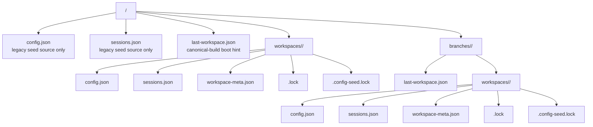

# Configuration

Arborist stores persistent state in JSON files under the OS app-data directory reported by Tauri. User-facing settings are editable through Settings
where possible; this document is for maintainers, troubleshooting, and carefully hand-editing config.

Stop the Arborist instance bound to the workspace before hand-editing its files. Sibling instances bound to other workspaces can keep running.

## App-data root

The leaf directory comes from `src-tauri/tauri.conf.json` `identifier`, currently `dev.arborist.desktop`.

| OS      | App-data root                                                                    |
| ------- | -------------------------------------------------------------------------------- |
| Windows | `%APPDATA%\dev.arborist.desktop\`                                                |
| macOS   | `~/Library/Application Support/dev.arborist.desktop/`                            |
| Linux   | `$XDG_DATA_HOME/dev.arborist.desktop/` or `~/.local/share/dev.arborist.desktop/` |

## Store layout

Every running Arborist process binds to one `(branch, workspace)` pair. The branch axis is the build-time `BUILD_BRANCH`; canonical builds with an
empty branch or `main` collapse the branch directory. The workspace axis is a deterministic key derived from the canonical workspace root path.



| File                  | Purpose                                                    |
| --------------------- | ---------------------------------------------------------- |
| `config.json`         | User/workspace config (`AppConfig`).                       |
| `sessions.json`       | Backend-owned persisted `Session` records.                 |
| `workspace-meta.json` | Canonical workspace root for this store.                   |
| `.lock`               | Advisory exclusive lock held for the process lifetime.     |
| `.config-seed.lock`   | Short-lived lock used while seeding a new workspace store. |
| `last-workspace.json` | Boot hint for the next launch. Best-effort only.           |

Legacy `config.json` and `sessions.json` directly under app data are used only as first-launch seed sources when no scoped store exists yet.

## Minimum valid `config.json`

```json
{
  "configVersion": 9,
  "defaultInstructionSets": {
    "claude": "claude-default",
    "copilot": "copilot-default"
  },
  "instructionSetsDir": "/absolute/path/to/instructions",
  "workspaceRoot": "/absolute/path/to/primary-clone",
  "worktreeRoots": [],
  "worktreePrepCommands": [],
  "aiLaunchCommands": {
    "commands": {},
    "iconDataUris": {}
  },
  "lastOpenSessions": [],
  "tabOrder": [],
  "activeSessionId": null,
  "customProcesses": [],
  "lastOpenSubSessions": [],
  "worktreeTabs": [],
  "worktreeTabOrder": [],
  "activeWorktreeTabId": null
}
```

`sidebarWidthPx` is optional. When present, the backend clamps it to the supported range.

## Important fields

| Field                                                     | Notes                                                                                                                    |
| --------------------------------------------------------- | ------------------------------------------------------------------------------------------------------------------------ |
| `configVersion`                                           | Current schema version. Future versions are quarantined to protect downgrade scenarios.                                  |
| `instructionSetsDir`                                      | Absolute directory scanned for instruction-set Markdown files. Relative paths are rejected on write and cleared on load. |
| `workspaceRoot`                                           | Active primary Git clone. Cleared if missing. Must not be a linked worktree.                                             |
| `worktreeRoots`                                           | Legacy discovery companion. New behavior should prefer `workspaceRoot`.                                                  |
| `worktreePrepCommands`                                    | Non-blank commands joined with `&&` and run once after `worktree_create` in the new worktree `cwd`.                      |
| `aiLaunchCommands.commands`                               | Plugin id to CLI command override. Missing or empty means use the plugin default.                                        |
| `aiLaunchCommands.iconDataUris`                           | Backend-managed icon cache. Frontend patches do not write this map.                                                      |
| `lastOpenSessions`, `tabOrder`, `activeSessionId`         | AI session restore and focus state. Managed by the app.                                                                  |
| `worktreeTabs`, `worktreeTabOrder`, `activeWorktreeTabId` | Top-level sidebar state. Managed by the app.                                                                             |
| `customProcesses`                                         | User-editable custom process definitions. Built-ins are seeded but not special afterward.                                |
| `lastOpenSubSessions`                                     | Lightweight restore records for custom-process sub-tabs. Managed by the app.                                             |

## Instruction-set discovery

`instructions_list` scans `instructionSetsDir` for `*.md` files:

1. Canonicalize each candidate.
2. Reject files whose canonical path escapes `instructionSetsDir`.
3. Skip files larger than 1 MiB.
4. Bind files prefixed with `claude-` to Claude and `copilot-` to Copilot.
5. Use the filename without `.md` as the instruction-set id.
6. Prefer `<tool>-default.md` as the default; otherwise use the first alphabetical match for that tool.

The repository `instructions/` directory contains starter templates. Runtime behavior uses the configured `instructionSetsDir`.

## Repo overlay

`<workspace>/.arborist/settings.json` can provide source-controlled repo defaults. It is read as an overlay at operational sites; `config_get`
returns the raw user config.

Supported overlay fields:

| Field                       | Behavior                                                                               |
| --------------------------- | -------------------------------------------------------------------------------------- |
| `defaultInstructionSets`    | Overrides default instruction-set ids for the repo.                                    |
| `aiLaunchCommands.commands` | Overrides plugin launch commands for the repo. Cached icon data remains machine-local. |
| `worktreePrepCommands`      | Overrides prep commands for worktrees created in the repo.                             |

Malformed overlay files are logged and ignored so a repository typo does not block local work.

## Custom process defaults

Fresh config and relevant migrations seed editable/deletable built-ins:

| ID            | Kind          | Command                                                    |
| ------------- | ------------- | ---------------------------------------------------------- |
| `shell`       | `terminal`    | Platform shell.                                            |
| `open-folder` | `application` | OS file browser for the worktree.                          |
| `vscode`      | `application` | `code .`, enabled when `code` is available during seeding. |

`config_set` validates custom process definitions:

- `id` matches `[A-Za-z0-9_-]+` and is unique.
- `name` and `command` are non-empty after trimming.
- `kind` is `terminal` or `application`.

Invalid persisted definitions are sanitized on load with warnings rather than poisoning the whole config.

## Quarantine recovery

If `config.json` or `sessions.json` cannot be parsed or has an unsupported schema version, Arborist:

1. Renames the bad file to `<name>.bad-<unix-timestamp>` in the same directory.
2. Logs `ConfigQuarantined`.
3. Continues with defaults for that file.

To recover:

1. Stop the Arborist instance for that workspace.
2. Fix the quarantined JSON.
3. Move it back to the original filename.
4. Relaunch Arborist.

If the contents are not needed, delete the `.bad-*` files.

## Safe editing checklist

- Stop the bound Arborist instance first.
- Validate JSON before saving.
- Use absolute paths.
- Do not manually add secrets, tokens, or CLI credentials.
- Prefer Settings for changes that the UI already supports.
- Let Arborist own `sessions.json` unless you are explicitly recovering from corruption.
