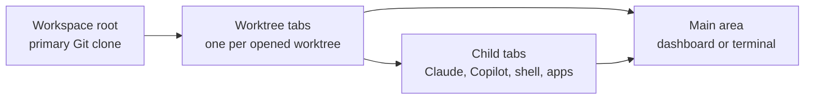

# Arborist overview

Arborist is a cross-platform desktop app for managing AI coding-assistant sessions across Git worktrees. It is built with Tauri v2, a Rust backend,
and a React/TypeScript frontend. The app gives each worktree a persistent terminal-backed session for Claude CLI, GitHub Copilot CLI, or a configured
custom process.

## Mental model

Arborist is workspace-first. One running Arborist process is bound to one local Git repository root, called the workspace root. Worktrees under that
workspace become top-level tabs in the sidebar. AI sessions and custom-process sub-sessions are children of a worktree tab.

Key ideas:

- The Rust backend owns every PTY and all persistent state.
- The frontend renders the sidebar, dashboards, settings, and xterm.js terminal viewports.
- Only the active terminal is attached to the DOM. Background PTYs keep running.
- Worktree paths are passed as process `cwd`; they are never interpolated into shell command strings.
- CLI authentication stays with the external tools. Arborist does not store credentials.

## What users do in Arborist

1. Pick a workspace root on first launch. The root must be a primary Git clone, not a linked worktree.
2. Open an existing worktree tab or create a new worktree under `<workspace>/.arborist/.worktrees/<name>/`.
3. Launch Claude, Copilot, or a configured custom process from the worktree tab context menu.
4. Switch between child tabs while every background PTY keeps running.
5. Close tabs when finished. Worktree-tab close cascades to children and can optionally remove the linked worktree.

## Main surfaces

| Surface              | Purpose                                                                                                 |
| -------------------- | ------------------------------------------------------------------------------------------------------- |
| Sidebar              | Top-level worktree tabs and child tabs for AI/custom-process sessions.                                  |
| Worktree dashboard   | Overview for the active worktree when no child tab is selected. Shows status widgets such as Git state. |
| Terminal viewport    | xterm.js view attached to the active AI session or terminal sub-session.                                |
| Settings             | Workspace, launch-command, sidebar, and custom-process configuration.                                   |
| Worktree prep banner | Status for one-shot prep commands kicked off after new worktree creation.                               |

## Supported tools

| Tool                       | Launch behavior                                                                                                                                    |
| -------------------------- | -------------------------------------------------------------------------------------------------------------------------------------------------- |
| Claude CLI                 | Runs bare in the worktree `cwd`. `CLAUDE.md` is auto-discovered by Claude from that directory.                                                     |
| GitHub Copilot CLI         | Runs bare in the worktree `cwd`. Arborist deliberately avoids `--instructions` so `.github/copilot-instructions.md` auto-discovery remains active. |
| Custom terminal process    | Runs a configured shell command in a PTY with the parent worktree as `cwd`.                                                                        |
| Custom application process | Launches a configured external application detached from Arborist. The tab tracks and can focus the process where the OS allows it.                |

## What Arborist is not

Arborist is not a chat UI, a remote worktree manager, a credential broker, or an Electron app. It is a local desktop shell around existing CLIs and
local Git worktrees.
