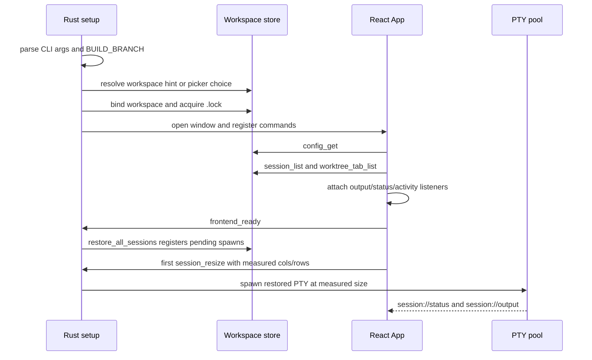
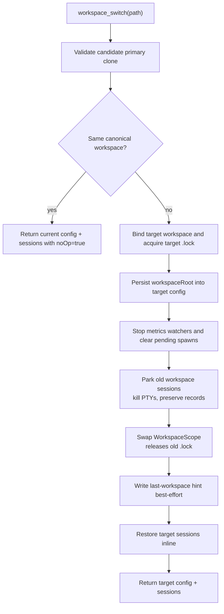
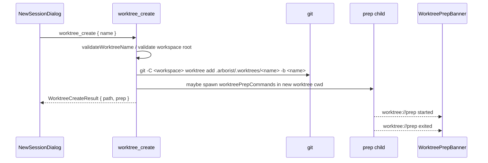
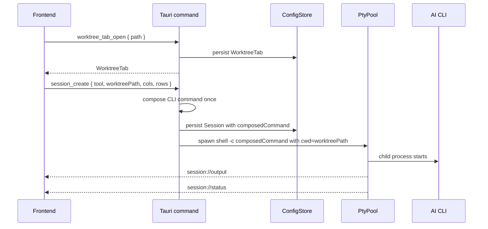
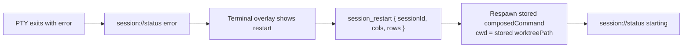
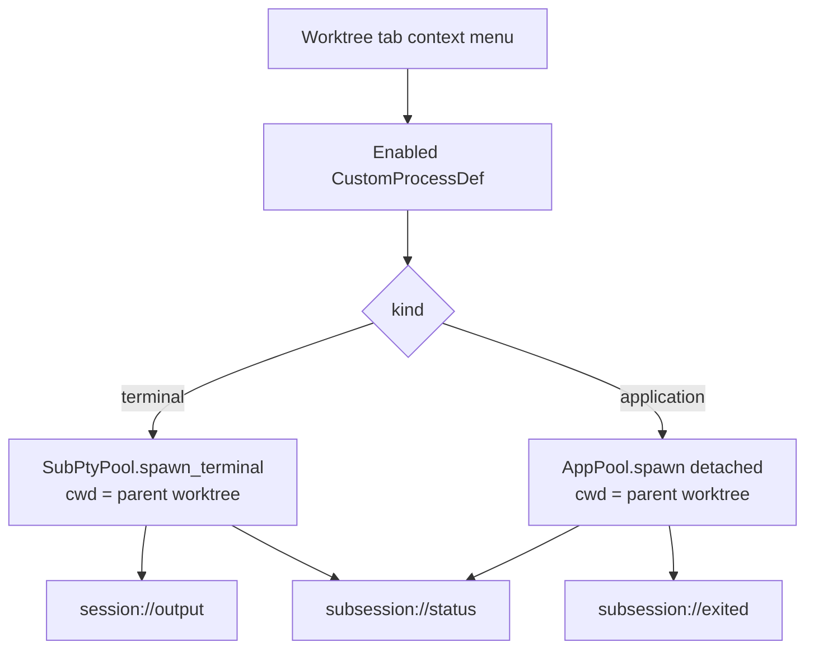
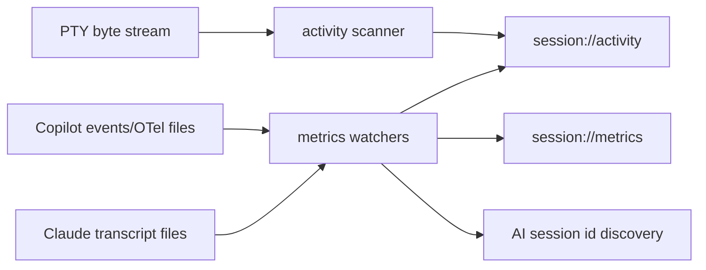

# Runtime flows

This document explains the behavior that matters most when changing Arborist. For the API surface, see [architecture](./architecture.md#command-and-event-contract).

## Boot and restore

Important details:

- Boot binds one `(branch, workspace)` store before the app context is built.
- The branch axis comes from build-time `BUILD_BRANCH`; canonical builds collapse the branch path.
- `frontend_ready` waits for restore registration to finish. This gives the first `session_resize` a pending spawn to consume.
- Restored sessions are spawned on first resize so the CLI's first paint sees the real terminal dimensions, not a fallback `80x24`.
- Restore augments the spawn-time command copy with `--resume <id>` where supported and safe. It never mutates the persisted `composedCommand`.
- One failed session restore does not abort the rest of the restore loop.

## Workspace switching

`workspace_switch` changes the workspace without restarting Arborist. The operation is serialized by `switch_lock` plus `switch_pending`, so lifecycle
commands either complete before the switch or reject/silently no-op according to their contract.

Parking is not closing. The old workspace keeps `sessions.json`, `lastOpenSessions`, `tabOrder`, and active ids so a later switch back can restore
those sessions.

If the target lock is held by another Arborist process for the same `(branch, workspace)`, the switch fails with `WorkspaceLocked` and the old
workspace remains bound.

## Worktree creation and prep

Prep commands are one-shot setup commands. They run only after `worktree_create`, never before every AI session launch. Combined stdout/stderr goes
to `<app_data_dir>/worktree-prep-logs/<prepId>.log`. Opening a prep log goes through `worktree_prep_open_log`, which validates that the path resolves
under the prep-log directory before asking the OS to open it.

Repo-level overrides from `<workspace>/.arborist/settings.json` can replace user-level prep commands for that repo.

## Opening a worktree tab and launching an AI session

Launch composition:

- Claude without an instruction set launches as bare `claude --settings <hooks-config>`; with an instruction set, `--system-prompt <temp-file>` is added alongside `--settings`. The Arborist session id is pre-allocated and spliced in via `--session-id <uuid>` on first spawn (`--resume <uuid>` on every subsequent spawn — restart, restore-on-launch).
- The `--settings` file registers the `arborist-claude-hook` sidecar binary against every hook event Arborist cares about. The user's own `~/.claude/settings.json` and project `.claude/settings.json` hooks are deep-merged in at session-create time, so user formatters / validators keep running. The helper appends one structured line to `<session_temp_dir>/hook-events.jsonl` per hook fire; the backend tails the file and emits `session://activity` events (`AwaitingPermission`, `ToolStart`/`ToolEnd`, `TurnStart`/`TurnEnd`).
- Copilot launches bare as `copilot`; Arborist does not pass `--instructions`.
- Custom AI launch commands replace the program token and are stored by plugin id.

The worktree path is always the process `cwd`. It is not embedded in `composedCommand`.

## Session restart

Restart intentionally starts a fresh AI conversation. App-restart restore can resume an AI conversation when the backend has a known AI session id;
manual restart clears or replaces that id according to the tool.

## Closing worktree tabs and sessions

Session close:

1. The frontend asks for confirmation.
2. `session_close` tears down the PTY and removes the session record.
3. If PTY kill/reap is unconfirmed, `teardownError` is returned and worktree deletion is refused because the process may still hold the worktree cwd.
4. If `deleteWorktree` is true and teardown was confirmed, the backend attempts `git worktree remove --force`.
5. Worktree deletion failure is returned as `worktreeDeleteError`; the session still closes.

Worktree-tab close:

1. The frontend asks for confirmation, including app close policy for application sub-sessions.
2. `worktree_tab_close` cascades to child AI sessions and sub-sessions.
3. Terminal children terminate. Application children detach or terminate according to policy.
4. Child teardown errors are returned in `childErrors`.
5. Optional worktree deletion happens only when child teardown reported no errors; deletion refusal/failure is returned as `worktreeDeleteError`.

## Custom-process sub-sessions

Terminal sub-sessions behave like AI PTYs but use a separate sub-session runtime. Application sub-sessions are external processes. Arborist tracks
their pid and attempts focus when the user clicks the sub-tab, but focus is best-effort and depends on OS support.

Close policy:

- Terminal sub-session: kill the PTY.
- Application `tabOnly`: remove Arborist tracking and leave the app running.
- Application `requestAppClose`: ask the OS/window to close politely where supported.
- Application `forceKill`: terminate the captured process. Use only as an escape hatch.

## Activity and metrics

Activity events drive sidebar state such as working, idle, attention, tool running, and awaiting permission. Metrics events drive token/context
display. Watchers deduplicate unchanged snapshots and stop/join during workspace switches so stale callbacks do not write into an old workspace.

## Event ordering expectations

Tauri preserves order per event name from one emitter, but Arborist does not rely on cross-event ordering. The frontend state machines must tolerate
`session://status`, `session://output`, `session://activity`, and `session://metrics` arriving in either order.
