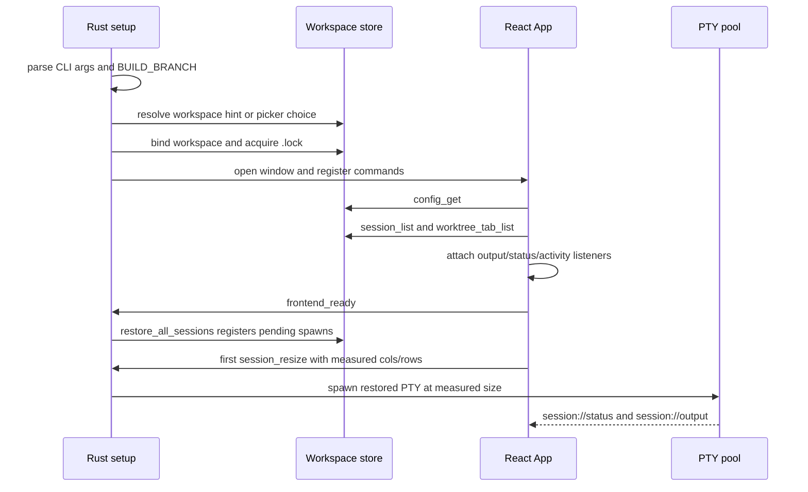
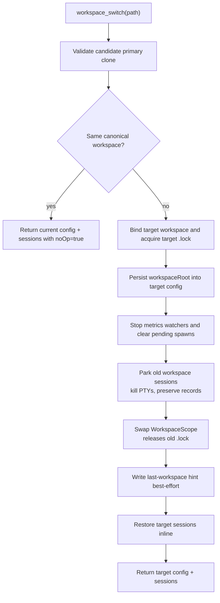
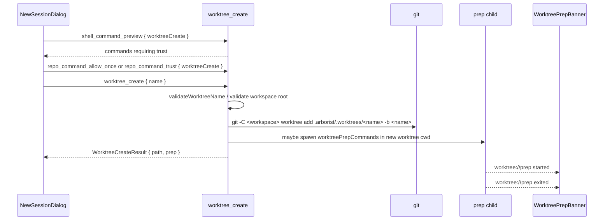
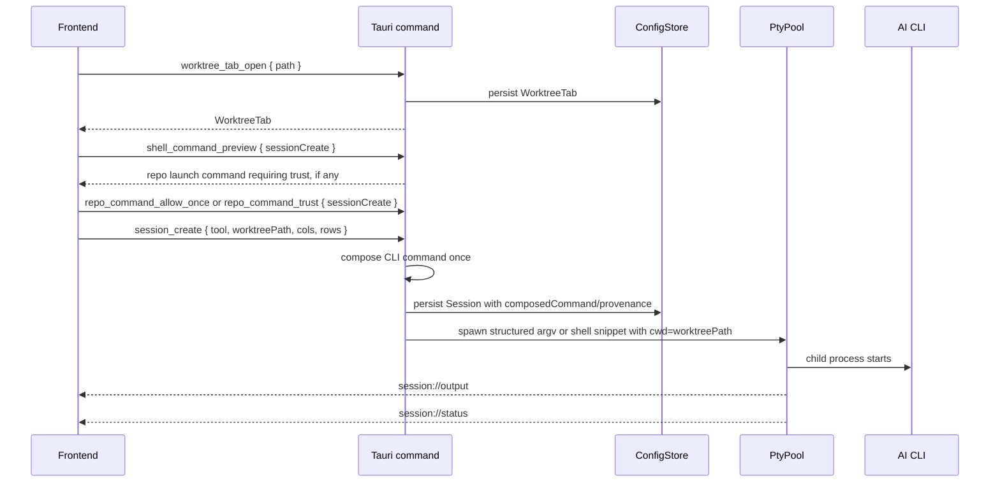
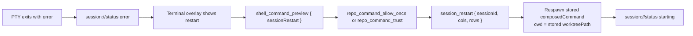
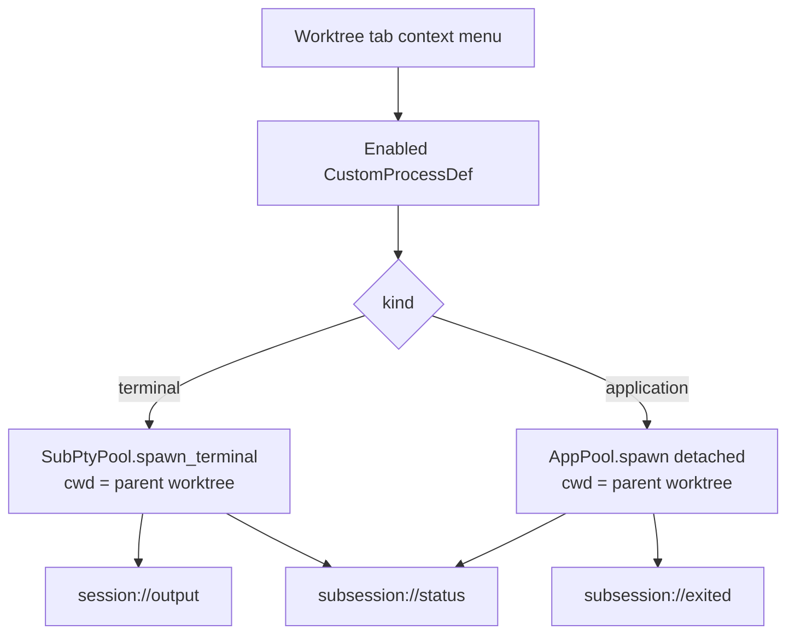
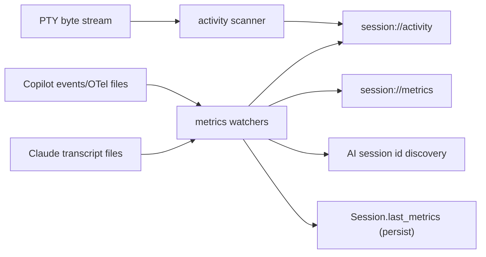

# Runtime flows

This document explains the behavior that matters most when changing Arborist. For the API surface, see [architecture](./architecture.md#command-and-event-contract).

## Boot and restore

Important details:

- Boot binds one `(branch, workspace)` store before the app context is built.
- The branch axis comes from build-time `BUILD_BRANCH`; canonical builds collapse the branch path.
- `frontend_ready` waits for restore registration to finish. This gives the first `session_resize` a pending spawn to consume.
- Restored sessions are spawned on first resize so the CLI's first paint sees the real terminal dimensions, not a fallback `80x24`.
- Restore augments the spawn-time command copy with the tool's create-or-resume token (`--resume <id>` for Claude, `--session-id <id>` for Copilot, `resume <id>` subcommand for Codex) where supported and safe. It never mutates the persisted `composedCommand`.
- One failed session restore does not abort the rest of the restore loop.
- **macOS PATH recovery.** On macOS only, the very first boot step (between `init_tracing` and CLI-arg parsing) queries the user's login shell (`<$SHELL> -ilc 'printf marker; echo $PATH'`) and applies the result via `std::env::set_var("PATH", …)`. `launchd` would otherwise start the `.app` with a minimal PATH (`/usr/bin:/bin:/usr/sbin:/sbin`) that's missing `~/.local/bin`, `~/.npm-global/bin`, Homebrew, etc., so `claude` / `copilot` would fail to launch from a Finder-started build. Any failure (timeout, missing `$SHELL`, parse error) is logged at `warn!` and leaves PATH unchanged — boot does not abort.

## Workspace switching

`workspace_switch` changes the workspace without restarting Arborist. The operation is serialized by `switch_lock` plus `switch_pending`, so lifecycle
commands either complete before the switch or reject/silently no-op according to their contract.

Parking is not closing. The old workspace keeps `sessions.json`, `lastOpenSessions`, `tabOrder`, and active ids so a later switch back can restore
those sessions.

If the target lock is held by another Arborist process for the same `(branch, workspace)`, the switch fails with `WorkspaceLocked` and the old
workspace remains bound.

## Worktree creation and prep

Prep commands are one-shot setup commands. They run only after `worktree_create`, never before every AI session launch. Combined stdout/stderr goes
to `<app_data_dir>/worktree-prep-logs/<prepId>.log`. Opening a prep log goes through `worktree_prep_open_log`, which validates that the path resolves
under the prep-log directory before asking the OS to open it.

Repo-level executable settings from `<workspace>/.arborist/settings.json` are defaults only. If the user has configured prep commands, the repo prep
commands are ignored and do not prompt. If repo prep commands apply, the frontend asks the backend for a preview before `worktree_create`; the user can
run once or persist "don't ask again" for the exact command fingerprint. The backend rechecks approval immediately before using the previewed config,
so changed repo snippets do not run under old approvals.

## Opening a worktree tab and launching an AI session

Launch composition:

- Claude launches as `claude` (repository-level `CLAUDE.md` discovery is handled by the CLI from the worktree `cwd`). When the `arborist-claude-hook` sidecar is found next to the running `arborist` binary, `--settings <hooks-config>` is added; otherwise it's omitted and the session runs without hook-based status reporting (the degraded path — sidebar falls back to PTY-byte heuristics). The Arborist session id is pre-allocated and spliced in via `--session-id <uuid>` on first spawn (`--resume <uuid>` on every subsequent spawn — restart, restore-on-launch).
- The `--settings` file (when written) registers the `arborist-claude-hook` sidecar binary against every hook event Arborist cares about. The user's own `~/.claude/settings.json` and project `.claude/settings*.json` are merged in at session-create time so user formatters / validators keep running — this is a shallow merge matching Claude's documented `--settings` precedence (last file wins on every top-level key except `hooks.<EventName>` arrays, which are concatenated; nested objects like `permissions` / `mcpServers` are not deep-merged). The helper appends one structured line to `<session_temp_dir>/hook-events.jsonl` per hook fire; the backend tails the file and emits `session://activity` events (`AwaitingPermission`, `ToolStart`/`ToolEnd`, `TurnStart`/`TurnEnd`).
- Copilot launches bare as `copilot`; Arborist does not pass `--instructions`. The conversation id is pre-allocated at session-create and spliced in via `--session-id <uuid>` on every spawn (create, restart, restore-on-launch). Requires `copilot >= 1.0.51`, which split `--session-id` (create-or-resume) from `--resume` (strict-resume-only).
- Custom AI launch commands replace the program token and are stored by plugin id.
- Default Claude/Copilot launches use structured argv. User launch overrides and applied repo launch defaults remain shell snippets because they
  intentionally allow extra args.
- Repo-provided launch defaults apply only when the user has not configured that tool's launch command. Applied repo launch defaults require approval
  before session creation. The user can run once or choose "don't ask again" for the exact command fingerprint; the session stores command provenance
  for later restart/restore checks.

The worktree path is always the process `cwd`. It is not embedded in `composedCommand`.

Active session temp artifacts live under `<os-temp>/arborist/<session-uuid>`. Copilot launch resets its `otel.jsonl` to an empty private file before
spawn, with owner-only permissions on Unix; session temp creation and cleanup refuse symlinks and Windows reparse points instead of traversing them.

## Session restart

Restart intentionally starts a fresh AI conversation for tools that opt into the `Clear` policy (Codex). Tools with `Preserve` policy (Claude, Copilot)
continue the same conversation across an in-app restart by re-binding the persisted AI session id at spawn (`--resume <id>` for Claude,
`--session-id <id>` for Copilot). App-restart restore can resume an AI conversation when the backend has a known AI session id. If the stored
session was created from an applied repo-provided launch default, restart and restore revalidate the persisted command provenance. Restore cannot
prompt, so an untrusted restored session is left in `error` state for the user to review and restart.

## Closing worktree tabs and sessions

Session close:

1. The frontend asks for confirmation.
2. `session_close` tears down the PTY, removes the session record, and attempts to remove the session temp directory.
3. If PTY kill/reap is unconfirmed, `teardownError` is returned and worktree deletion is refused because the process may still hold the worktree cwd.
4. If `deleteWorktree` is true and teardown was confirmed, the backend attempts `git worktree remove --force`.
5. Worktree deletion failure is returned as `worktreeDeleteError`; the session still closes.

Worktree-tab close:

1. The frontend asks for confirmation, including app close policy for application sub-sessions.
2. `worktree_tab_close` cascades to child AI sessions and sub-sessions.
3. Child AI session teardown uses the same session temp cleanup path, including Copilot OTel file cleanup.
4. Terminal children terminate. Application children detach or terminate according to policy.
5. Child teardown errors are returned in `childErrors`.
6. Optional worktree deletion happens only when child teardown reported no errors; deletion refusal/failure is returned as `worktreeDeleteError`.

## Custom-process sub-sessions

Terminal sub-sessions behave like AI PTYs but use a separate sub-session runtime. Application sub-sessions are external processes. Arborist tracks
their pid and attempts focus when the user clicks the sub-tab, but focus is best-effort and depends on OS support.

Close policy (returns a `SubSessionCloseResult { outcome, status, pid?, message? }` so the UI can branch on actual behaviour rather than the requested
intent):

- Terminal sub-session: kill the PTY tree (SIGKILL on Unix, `TerminateProcess` on the whole Windows process tree). Outcome `terminalKill`, status
  `confirmed` when the wait thread joined within the grace window, or `unconfirmed` when it did not. The store record is pruned either way (an
  unconfirmed terminal close still issued the kill signal — the failure mode is "child may linger", not "child is definitely alive"); the result
  carries the lingering PID so the UI can warn the user that they may need to clean up the orphan manually.
- Application `tabOnly`: drop Arborist tracking only. Outcome `tabRemoved`, status `confirmed`.
- Application `requestAppClose`: ask the OS/window to close politely (Windows: `WM_CLOSE`). Verified by **window-handle existence** first
  (`IsWindow`) so shared editors like VS Code that survive a single window close are correctly reported as still running, falling back to PID
  liveness when there's no window target. Outcomes: `politeClose/confirmed` (window gone within ~3s), `politeClose/unconfirmed` (the app is likely
  showing a save-changes prompt), `politeClose/unsupported` (the focuser doesn't support the request on this OS — currently macOS / Linux), or
  `politeClose/unavailable` (we never matched a window). Tab is removed regardless.
- Application `forceKill`: skip the polite step and signal the launcher PID directly (Unix: SIGKILL; Windows: `TerminateProcess`). Outcomes:
  `forceKill/confirmed` (PID-liveness probe says the process is gone within ~2s), `forceKill/unconfirmed` (the OS hasn't confirmed exit — the
  message includes the lingering PID), or `forceKill/refusedShared` (the runtime is retargeted onto a shared editor process — killing it would
  also close every other workspace window the user has open in that editor, so Arborist refuses and detaches the tab instead).

The same primitives back the worktree-tab cascade (`worktree_tab_close`). Cascade per-sub outcomes are surfaced via
`WorktreeTabCloseResult.subOutcomes` — every per-sub close result (success or refusal) goes there, while unexpected operational failures (e.g.
polite-close API throwing, app-pool internal errors) go into `childErrors`. Worktree directory deletion (when requested) is refused either when
`childErrors` is non-empty OR when any application sub-session was kept alive — Detach policy left it running (`outcome = tabRemoved`), or its
polite/force kill returned `unconfirmed`/`refusedShared`. Terminal subs are reaped via their PTY tree and cannot pin the worktree once observed
exiting, so they never gate deletion on their own.

## Activity and metrics

Activity events drive sidebar state such as working, idle, attention, tool running, and awaiting permission. Metrics events drive token/context
display and are also persisted on the session record (`last_metrics`) so the frontend can seed its metrics store on restore without waiting for the
watcher to re-emit. Watchers deduplicate unchanged snapshots and stop/join during workspace switches so stale callbacks do not write into an old
workspace.

## Event ordering expectations

Tauri preserves order per event name from one emitter, but Arborist does not rely on cross-event ordering. The frontend state machines must tolerate
`session://status`, `session://output`, `session://activity`, and `session://metrics` arriving in either order.
