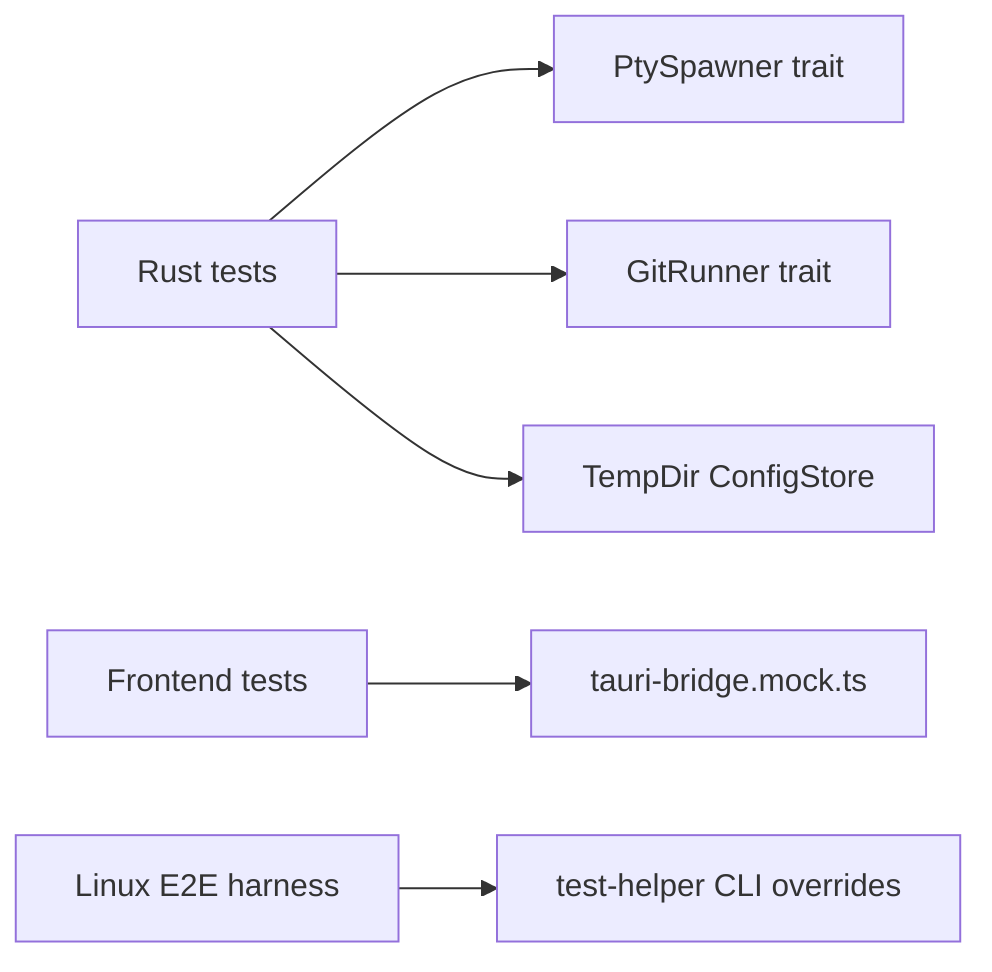

# Testing

Arborist tests should be deterministic, focused on public seams, and independent of real AI CLIs. Use this guide with the commands in
[development](./development.md).

## Test layout

### Rust

| Location                                         | Purpose                                                                                    |
| ------------------------------------------------ | ------------------------------------------------------------------------------------------ |
| `src-tauri/src/<module>.rs::tests`               | Unit tests for pure logic such as composition, validation, migrations, parsing, and serde. |
| `src-tauri/tests/*.rs`                           | Integration tests through public crate and command-implementation seams.                   |
| `src-tauri/src/test_bin/arborist_test_child.rs`  | Deterministic PTY child used by integration tests.                                         |
| `src-tauri/src/test_bin/arborist_test_locker.rs` | Cross-process workspace-lock helper.                                                       |
| `src-tauri/examples/config_smoke.rs`             | Manual config-store smoke harness.                                                         |

Important integration suites:

| File                             | Coverage                                                                                             |
| -------------------------------- | ---------------------------------------------------------------------------------------------------- |
| `pty_pool.rs`                    | PTY spawn, IO, resize, exit, backpressure, UTF-8 splitting, orphan cleanup, wait-thread persistence. |
| `session_lifecycle_fake.rs`      | Session command flow with a fake PTY spawner.                                                        |
| `session_lifecycle_real.rs`      | Portable PTY happy path through the test child binary.                                               |
| `sub_sessions_e2e.rs`            | Custom-process sub-session lifecycle.                                                                |
| `workspace_command.rs`           | Workspace validation and switching behavior.                                                         |
| `workspace_lock_multiprocess.rs` | Lock contention across processes.                                                                    |
| `worktree_tab_command.rs`        | Worktree tab hierarchy behavior.                                                                     |
| `worktrees_command.rs`           | Git worktree porcelain parsing.                                                                      |
| `capability_gating.rs`           | Command/capability/permission structural consistency.                                                |

### Frontend

| Location                                   | Purpose                                                             |
| ------------------------------------------ | ------------------------------------------------------------------- |
| `src/**/*.test.ts` and `src/**/*.test.tsx` | Vitest tests colocated with stores, hooks, components, and plugins. |
| `src/test/setup.ts`                        | Shared Vitest setup.                                                |
| `src/lib/tauri-bridge.mock.ts`             | Whole-module mock for bridge calls.                                 |
| `src/types/fixtures/`                      | Shared wire-shape fixtures for type parity checks.                  |

## Test seams



| Seam              | Production                  | Tests                                  |
| ----------------- | --------------------------- | -------------------------------------- |
| `PtySpawner`      | `PortablePtySpawner`        | Fake spawner or `arborist-test-child`. |
| `GitRunner`       | `RealGitRunner`             | Canned porcelain output.               |
| `ConfigStore`     | App-data workspace store    | `tempfile::TempDir`.                   |
| Tauri bridge      | `@tauri-apps/api` wrappers  | `vi.mock('@/lib/tauri-bridge', ...)`.  |
| AI launch command | Tool default or user config | `aiLaunchCommands.commands` override.  |

## Test-writing rules

- Write a failing test before fixing a bug.
- Write tests alongside new behavior.
- Test public seams, not private plumbing.
- Keep tests deterministic: no real network, no real AI CLIs, no arbitrary sleeps.
- Use temp directories for filesystem tests.
- Use fake timers for polling or debounced frontend behavior when possible.
- Mock the whole Tauri bridge in frontend unit tests.
- Avoid snapshots as the only assertion.

## Commands

```sh
pnpm test
pnpm test --run
cargo test --workspace --features test-helpers
cargo test --workspace --features test-helpers <test-name-prefix>
```

`cargo test --workspace --features test-helpers` builds the helper binaries and exposes paths such as
`CARGO_BIN_EXE_arborist-test-child` to integration tests.

## Dependency audit checks

These checks are separate from unit/integration tests and target supply-chain risk:

```sh
pnpm audit --prod --audit-level=moderate
pnpm audit --audit-level=high
cargo install --locked --version 0.19.6 cargo-deny
cargo deny check advisories licenses
```

## Linux E2E harness

The Dockerized Linux E2E harness lives under `dev/e2e/linux/`.

```sh
pnpm run e2e:linux:build
pnpm run e2e:linux
pnpm run e2e:linux:rust
pnpm run e2e:linux:vitest
pnpm run e2e:linux:shell
```

Use this harness for real Tauri/WebView coverage that unit and integration tests cannot provide. E2E tests should still use temporary workspaces and
stub CLI helpers, never a developer's real `claude` or `copilot` state.

## Capability-gating checklist

When adding a Tauri command, update:

1. `src-tauri/src/commands/mod.rs`.
2. `tauri::generate_handler![...]` in `src-tauri/src/lib.rs`.
3. A `src-tauri/permissions/allow-<command>.toml` file.
4. `src-tauri/capabilities/main.json`.
5. `src-tauri/tests/capability_gating.rs`.
6. `src/lib/tauri-bridge.ts`.
7. `src/lib/tauri-bridge.mock.ts`.
8. `src/types/arborist.ts` if payload/result types changed.
9. [architecture](./architecture.md#command-and-event-contract).

## Manual smoke checks

Use manual smoke checks for OS/WebView behavior that is difficult to automate:

- Create multiple sessions, switch tabs rapidly, and confirm terminal instances do not leak.
- Pump high-throughput output and confirm other sessions remain responsive.
- Exercise workspace switch with live sessions.
- Confirm application sub-tab focus behavior on each platform.
- Confirm release artifacts launch on clean machines.

Record notable release smoke results in the release PR or release notes rather than in source-controlled scratch files.
